# Welcome to Ishkur's Guide to Electronic Music. v2.5

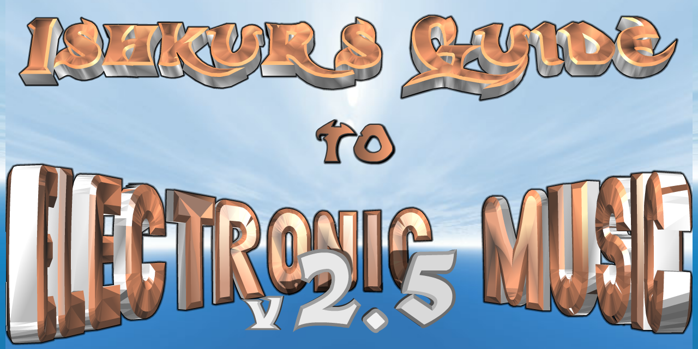

If you've never been here before, you may find this thing a bit daunting at first glance, unsure where to go and how to begin. So I have made a tutorial to get you aquainted with what this music is and where it came from. I recommend you start there.

If you are a longtime visitor of this guide, read the tutorial anyway, or go poke around at your leasure. You don't need my help. Just make sure your head is completely pulled out of your ass before proceeding.

------------------------------------------------------------

<!-- MarkdownTOC autolink="true" markdown_preview="github" -->

- [Tutorial](#tutorial)
	- [Origin](#origin)
	- [1982](#1982)
	- [1970](#1970)
	- [1955](#1955)
	- [1949](#1949)
	- [1929](#1929)
	- [1917](#1917)
	- [1897](#1897)
	- [1876](#1876)
	- [1761](#1761)
	- [1641](#1641)
	- [300 BC](#300-bc)
	- [65,000 BC](#65000-bc)
	- [The Music](#the-music)
- [Gear](#gear)
	- [Tech 12:*Technics SL-1200 Turntable*](#tech-12technics-sl-1200-turntable)
	- [TB-303:*Roland TB-303 Bassline*](#tb-303roland-tb-303-bassline)
	- [TR-808:*Roland TR-808 Drum Machine*](#tr-808roland-tr-808-drum-machine)
	- [TR-909:*Roland TR-909 Drum Machine*](#tr-909roland-tr-909-drum-machine)
- [Samples](#samples)
	- [Amen Break](#amen-break)
	- [Funky Drummer](#funky-drummer)
- [Sounds](#sounds)
	- [Hoover](#hoover)
	- [MC](#mc)
- [Disclaimer](#disclaimer)
- [Credits](#credits)

------------------------------------------------------------

# The Guide:

- [House](#house)
	- [Stupid: Stupid House](#stupid-stupid-house)
	- [Deep: Deep House](#deep-deep-house)
	- [Disco House](#disco-house)
	- [French: French House](#french-french-house)
	- [Funky: Funky House](#funky-funky-house)
	- [Latin: Latin House](#latin-latin-house)
	- [Anthem: Anthem House](#anthem-anthem-house)
	- [Epic: 'Dance Mix'](#epic-dance-mix)
	- [Eurobeat](#eurobeat)
	- [Eurodance: Europop, Euro, Club House, Handbag](#eurodance-europop-euro-club-house-handbag)
	- [Happy: Happy House](#happy-happy-house)
	- [Jpop](#jpop)
	- [Nu Italo](#nu-italo)
	- [Vocal: Vocal House](#vocal-vocal-house)
	- [Techno Dance](#techno-dance)
	- [Italo: Italo Disco](#italo-italo-disco)
	- [New Wave](#new-wave)
	- [Synthpop](#synthpop)
	- [Disco](#disco)
	- [Acid: Acid House](#acid-acid-house)
	- [Classic: Classic House](#classic-classic-house)
	- [Garage](#garage)
	- [Hip: Hip House](#hip-hip-house)
	- [Booty: Booty House](#booty-booty-house)
	- [Dark: Dark House](#dark-dark-house)
	- [Hard: Hard House](#hard-hard-house)
	- [Microhouse](#microhouse)
	- [Progressive: Progressive House](#progressive-progressive-house)
	- [Speed Garage](#speed-garage)
	- [Synthtron](#synthtron)
	- [Tech: Tech House](#tech-tech-house)
	- [Tribal](#tribal)
	- [Dub](#dub)
	- [Brit: Uk House, English House, Not Progressive](#brit-uk-house-english-house-not-progressive)
- [Trance](#trance)
	- [Buttrock Goa: Heavy Metal Goa](#buttrock-goa-heavy-metal-goa)
	- [Death: Death Trance](#death-death-trance)
	- [Goa: Hippie Trance](#goa-hippie-trance)
	- [Psychedelic: Psytrance, Psychedelic Goacore](#psychedelic-psytrance-psychedelic-goacore)
	- [Psytekk: Minimal Psytrance, Augh!!!!!!!](#psytekk-minimal-psytrance-augh)
	- [EBM: Ebm](#ebm-ebm)
	- [Electro Industrial: Electro-Industrial](#electro-industrial-electro-industrial)
	- [Futurepop](#futurepop)
	- [Coldwave](#coldwave)
	- [Darksynth](#darksynth)
	- [Darkwave](#darkwave)
	- [Experimental: Industrial Experimental](#experimental-industrial-experimental)
	- [Indistrial Rock: Industrial Rock](#indistrial-rock-industrial-rock)
	- [Goth](#goth)
	- [Industrial](#industrial)
	- [Hard: Hard Trance](#hard-hard-trance)
	- [Hard Acid: Hard Acid Trance](#hard-acid-hard-acid-trance)
	- [NRG: Nu Nrg, Hard Nrg, Hard Dance](#nrg-nu-nrg-hard-nrg-hard-dance)
	- [Hardstyle: Really Hard Trance, Hard Dance](#hardstyle-really-hard-trance-hard-dance)
	- [Anthem: Mctrance, Stadium Trance, Arena Trance](#anthem-mctrance-stadium-trance-arena-trance)
	- [Dream: Dream Trance](#dream-dream-trance)
	- [Epic: Epic Trance](#epic-epic-trance)
	- [Ibiza: Ibiza Trance](#ibiza-ibiza-trance)
	- [Progressive: Progressive House???](#progressive-progressive-house-1)
	- [Symphonic: Symphonic Trance](#symphonic-symphonic-trance)
	- [Dutch: Super Saw Mega Trance, Fake Trance](#dutch-super-saw-mega-trance-fake-trance)
	- [Booty ???: Booty Trance???](#booty--booty-trance)
	- [Break: Breaktrance](#break-breaktrance)
	- [Dark: Dark Trance](#dark-dark-trance)
	- [Deep: Housey Trance....Or Trancey House](#deep-housey-tranceor-trancey-house)
	- [Tech: Tech Trance](#tech-tech-trance)
	- [Tribal: Tribal Trance](#tribal-tribal-trance)
	- [Acid](#acid)
	- [Classic: Trance](#classic-trance)
	- [German: German Trance](#german-german-trance)
	- [Hi NRG: Hi Nrg](#hi-nrg-hi-nrg)
- [Techno](#techno)
	- [Bangin’: Bangin' Techno](#bangin-bangin-techno)
	- [Deep: Deep Techno](#deep-deep-techno)
	- [Dub: Dub Techno](#dub-dub-techno)
	- [Gloomcore](#gloomcore)
	- [Minimal: Minimal Techno](#minimal-minimal-techno)
	- [Classic: Classic Techno](#classic-classic-techno)
	- [Detroit: Detroit Techno](#detroit-detroit-techno)
	- [Detroit House](#detroit-house)
	- [Acid](#acid-1)
	- [Casiocore](#casiocore)
	- [German: German Techno](#german-german-techno)
	- [Hard: Hard Techno](#hard-hard-techno)
	- [Hard Acid: Hard Acid Techno](#hard-acid-hard-acid-techno)
	- [Industrial: Industrial Techno](#industrial-industrial-techno)
	- [Italian: Italian Techno](#italian-italian-techno)
	- [Jtek](#jtek)
	- [Latin: Latin Techno](#latin-latin-techno)
	- [Swedish: Swedish Techno](#swedish-swedish-techno)
	- [Tribal: Tribal Techno](#tribal-tribal-techno)
	- [Euro: Euro Techno](#euro-euro-techno)
	- [VGM: Vgm](#vgm-vgm)
	- [Experimental: Experimental Techno](#experimental-experimental-techno)
- [Breakbeat](#breakbeat)
	- [2-Step Garage](#2-step-garage)
	- [Nu Soul](#nu-soul)
	- [New Jack Swing](#new-jack-swing)
	- [Abstract Hip Hop](#abstract-hip-hop)
	- [G-Funk](#g-funk)
	- [Gangsta: Gangsta Rap](#gangsta-gangsta-rap)
	- [East Coast: East Coast Rap](#east-coast-east-coast-rap)
	- [Hip Hop](#hip-hop)
	- [Progressive Hop](#progressive-hop)
	- [Turntablism](#turntablism)
	- [West Coast: West Coast Rap](#west-coast-west-coast-rap)
	- [Electro](#electro)
	- [Crunk](#crunk)
	- [Ghetto Tech](#ghetto-tech)
	- [Dirty South: Dirty South Rap](#dirty-south-dirty-south-rap)
	- [Miami Bass](#miami-bass)
	- [Acid: Acid Breaks](#acid-acid-breaks)
	- [Big Beat](#big-beat)
	- [Chemical: Chemical Breaks](#chemical-chemical-breaks)
	- [Dark: Dark Breaks](#dark-dark-breaks)
	- [Florida: Florida Breaks](#florida-florida-breaks)
	- [Funky: Funky Breaks](#funky-funky-breaks)
	- [Nu Electro](#nu-electro)
	- [Nu Skool: Nu Skool Breaks](#nu-skool-nu-skool-breaks)
	- [Progressive: Progressive Breaks](#progressive-progressive-breaks)
	- [Rio Funk](#rio-funk)
	- [Tribal: Tribal Breaks](#tribal-tribal-breaks)
	- [Freestyle](#freestyle)
	- [Electro Funk](#electro-funk)
	- [Anthem: Anthem Breaks](#anthem-anthem-breaks)
- [Jungle](#jungle)
	- [Experimental: Experimental Jungle](#experimental-experimental-jungle)
	- [Glitch](#glitch)
	- [IDM: Idm](#idm-idm)
	- [Industrial: Industrial Dnb](#industrial-industrial-dnb)
	- [Atmospheric: Atmospheric Jungle](#atmospheric-atmospheric-jungle)
	- [Darkcore](#darkcore)
	- [Darkstep](#darkstep)
	- [Drum n Bass: Drum N Bass](#drum-n-bass-drum-n-bass)
	- [Hardstep](#hardstep)
	- [Jazzstep](#jazzstep)
	- [Jump Up](#jump-up)
	- [Neurofunk](#neurofunk)
	- [Oldskool: Oldskool Rave Hardcore](#oldskool-oldskool-rave-hardcore)
	- [Techstep](#techstep)
	- [Jungle](#jungle-1)
	- [Ragga: Ragga Jungle](#ragga-ragga-jungle)
	- [Liquid Funk](#liquid-funk)
	- [Trancestep](#trancestep)
- [Hardcore](#hardcore)
	- [Happy: Happycore](#happy-happycore)
	- [Happy Gabber: Bouncy Techno](#happy-gabber-bouncy-techno)
	- [Nu Style Gabber](#nu-style-gabber)
	- [Trancecore](#trancecore)
	- [Freeform: Acidcore](#freeform-acidcore)
	- [Digital: Digital Hardcore](#digital-digital-hardcore)
	- [Gabber](#gabber)
	- [Gabber House](#gabber-house)
	- [Metalcore](#metalcore)
	- [Noizecore](#noizecore)
	- [Power Electronics](#power-electronics)
	- [Rave: Hardcore](#rave-hardcore)
	- [Rotterdam](#rotterdam)
	- [Speedbass](#speedbass)
	- [Speedcore](#speedcore)
	- [Terrorcore](#terrorcore)
	- [New Beat](#new-beat)
- [Downtempo](#downtempo)
	- [Ambient](#ambient)
	- [Classical: Electronic Classical](#classical-electronic-classical)
	- [French Pop](#french-pop)
	- [Minimalism](#minimalism)
	- [Psychedelia: Electronic Psychedelia](#psychedelia-electronic-psychedelia)
	- [Synth: Early Synth](#synth-early-synth)
	- [Musique Concrete](#musique-concrete)
	- [Acid Jazz: Rare Groove, Jazzdance](#acid-jazz-rare-groove-jazzdance)
	- [Ambient Breaks](#ambient-breaks)
	- [Downbeat: Not Exactly Trip Hop, Not Exactly Acid Jazz](#downbeat-not-exactly-trip-hop-not-exactly-acid-jazz)
	- [Illbient](#illbient)
	- [Trip Hop: Dub Hop, Brit Hop](#trip-hop-dub-hop-brit-hop)
	- [Nu Jazz](#nu-jazz)
	- [Ambient Psy](#ambient-psy)
	- [Ambient Techno](#ambient-techno)
	- [Ambient Trance](#ambient-trance)
	- [Dark Ambient](#dark-ambient)
	- [Electronica](#electronica)
	- [Sound Collage](#sound-collage)
	- [Worldbeat: Ethnic](#worldbeat-ethnic)
	- [Ambient House](#ambient-house)
	- [Ethereal](#ethereal)
	- [New Age: Easy Listening](#new-age-easy-listening)

<!-- /MarkdownTOC -->

------------------------------------------------------------

# Tutorial

Ishkur's Electronic Music Tutorial

## Origin

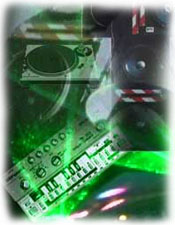 Electronic Music

So where did it all begin? How did it all start? Who was the first guy who said "Holy shit, this buzzing, spitting, throbbing, pulsing din of an inane sequence of noises that might arguably call itself music sounds totally awesome on ecstasy!" And what made him do that?

But maybe I'm getting ahead of myself. To try and pinpoint the exact origins of electronic music, you first have to look at how it's made. Because as amazing as it sounds, electronic instruments did not always exist. The vast majority of them are barely more than 20 years old. And it's not like you can just pick up a sampler, synth and drum machine and jam away. Unlike conventional music, electronic music isn't played, per se. It is PROGRAMMED. So any study of the history of electronic music is really a study of its programmers--that is, the people who make the machines that make the sounds that make the music what it is. Without some guy tinkering with diodes and transistors, electronic music is just a fancy, lifeless hunk of junk. Just sitting there. Not doing anything.

Because of this, more than any other music medium, electronic music thrives on technology to make it what it is. And moreover, to make it better and different than what it was. Other instruments have remained largely unchanged since their original design centuries ago, but electronic music is constantly evolving and changing its sound with the application of technology. A new oscillation, patch or filter could take it in an entirely new direction. It is the one form of music where the equipment manufacturers have probably a greater control over the final musical output than the artists. Acid wasn't invented by a musician, it was invented by Tadao Kikumoto, creator of the Roland TB-303 Bassline. Without the 303, there is no acid. Without Kikumoto's fucked up design schematic, there is no 303. Up until recently, electronic musicians were practically at the mercy of the designers who programmed the sounds into the machines. In a way, the instruments don't make the music, the instruments ARE the music. It's a very Macluhanesque way of looking at things, I know, but trust me: It all makes sense.

So what was the first technological apparatus that kicked things off, then? Well, to answer that question, we have to go all the way back to.....

## 1982

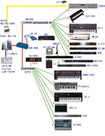 MIDI

1982 was when it all began. Yes, 1982 was the pivotal year that electronic music crashed into prominence. Nothing happened earlier than that. And it was all due to the creation of a single, ingenius invention, one of the most celebrated collaberations of collaberaters in the standards-fractured world of electronic equipment: MIDI. 

It stands for Musical Instrument Digital Interface. It's pronounced "middy". At least, that's what I've always called it. It is both a language and an operating system, a protocol and a standard all in one. It could even feed the dog and put the kids to bed. What it is NOT, as dumb computer users have come to think of thanks to stupid Geocities pages, is an audio format. It is not a cheap, tinny, low size form of audio like MP3 or WAV, you idiots. Those .mids you see aren't actual music. They just contain instructions of what kind of notes a MIDI-enabled device (like most computer soundcards have a crude version of--yes, that 8-bit noise you hear) should play and how to play them. I'm going to say this again: MIDI IS NOT AUDIO, dummies. It is like sheet music. For computers. It tells computers how to play music. And it was around long before annoying famewhores ever thought of embedding it in their obnoxious, head-decapitating webpages.

MIDI was a revolution in electronics manufacturing. It was a landmark idea during an age where standards were fragmenting and computer companies were coming out with different languages, protocols, applications and operating systems every day. All the electronic music equipment manufacturers--or at least all the important ones, anyway--decided to put an end to all the compatibility issues by coming together and hammering out a single, solid, ever-dependable universal standard protocol. Once and for all. Under this standard, it didn't matter if your drum machine was from Roland and your keyboard was from Yamaha and your effects processor was from Akai. MIDI made them work together, talk to one another, get the band back together and not be so pissed off that the lead singer ran off with their girlfriend. 

MIDI ushered in an age of uber compatibility across the board. Everything, from samplers, sequencers, software, synths and effects processors could simply be hooked up to one another via two simple to attach cables (one to send data, one to receive it), and work together flawlessly, with little to no hassle, turning the electronic musician into an orchestra. But the best part was what they did next: they released the MIDI spec into the public domain, liberated it from proprietorship, thereby allowing every piece of equipment made afterward to adhere to its standard. This would be like if Microsoft made Windows free and public, and EVERY PROGRAM EVER MADE, past, present and future, for Mac, Unix, or even Amiga, Wang or Commodore 64, would work under it. Without fail. Damn. That would make computers so much more awesomer.

MIDI also allowed one other important thing to happen: continuous music in video games. Before MIDI, injecting sounds into video games was often difficult and expensive. Audio was notoriously large to inscribe digitally, and early cartridge systems like Atari and Intellivision barely had the room to squeeze much more than a few blips and bleeps into their games. With MIDI came a much more compact way to shove sound effects and music onto the games. Because remember: MIDI is not audio. It is simply a series of text instructions. And text, as we all know, is far smaller than media. So when the new generation of Nintendos and Genesis' came around, they had MIDI soundbanks hard-coded into their consoles, all the carts had to carry were instructions of what music to play and how to play it. And there you go--streaming Super Mario Bros. music for a fraction of the size. What a brilliant idea, eh?

So now you understand why the electronic music industry will always triumph over the computer industry, because the computer industry is dumb. And it all started in 1982, with the creation of MIDI, that allowed electronic instruments to hook up with one another, and finally free themselves from the bonds of you filthy humans.

[HEAR Stupid Geocities MIDI music](guide_data/sounds/56.mp3)

## 1970

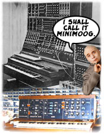 Minimoog

Wait. Scratch that last bit. 1970! Yes, 1970 was the year everything started! That was the year Bob Moog--the eminent electronic music equipment manufacturer at the time--teamed up with Dr. Evil to create the Minimoog, a synthesizer that was every much as awesome as his original Moog Modular....only one-tenth its size.

This was important. Like all things electronic, everything tends to start out really fucking big, and then get smaller as time goes on. Moog had been making synthesizers since 1961, the only problem was barely any of them could fit inside a room. Therefore, the only people who had access to them were bigwig recording studios and people with lots of money but little to no musical talent. Or transexuals. And don't even get me started on the learning curve, which consisted of studying the original design schematics to figure out how to turn the things on (only to learn that they required 1.21 gigawatts of electricity). When they actually managed to produce a note on key--which wasn't often--they usually blew out 30 vacuum tubes in the process, and then everyone had to evacuate the room, because the smoke was toxic. 

The Minimoog changed all that. It was small. You could carry it through a doorway. You might even take it on the road, which is why Pink Floyd didn't start becoming a listenable live band until they could take their studio sound effects gizmos on tour with them.

But most importantly, it led to a revolution in electronic equipment manufacturing that was paramount in making electronic music accessible to a whole class of people who wouldn't otherwise be exposed to it. I'm talking, of course, about black people. And this is really important in electronic music's development, because up until now the genre had been completely dominated by white people. And not just white people, but the squarest of the white people. White people who were even too white for white people. Mostly scientists, mathematicians and Parisian experimentalists. People so stuffy, pretentious and intellectual, for them getting down and boogeying was picking a nickle up off the street.

This sounds like a broken record, but once again the brother saves humanity from turning into a race of boring dunces. While Italian futurists and musique concrete tards were busy patting themselves on the back about how insipidly genius they thought their cat-strangling atonal compositions were, jazz and soul musicians picked up the Minimoog and immediately found its raw edgeyness to be something quaint and funky. The low-fi sounds of these quirky analog boxes led to one of the most endearing electronic samples of all time, courtesy of the Ohio Player's Club: The Funky Worm. From there came Herbie Hancock and George Clinton, always game for futurism, but not futurism the way the french and italians envisioned through stiff intellectualism and mathematic precision, but rather a weird, warped future full of funky freedom, camp sci-fi themes, and operatic space sets featuring an alien mothership descending upon the world to drop DA BOMB on y'all. Oh yeah. Make mine the P-funk.

From here, things would only get better, and by better I mean blacker. There are lots of great exceptions, but generally white people just suck at making electronic music.

[HEAR The Funky Worm](guide_data/sounds/72.mp3)

## 1955

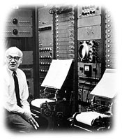 RCA Mark II Synth

1955!! I forgot about 1955. Now, 1955 was the year of electronic music's genesis. I mean it. For real. Forget everything I said before. To find out where electronic music came from, you need to go all the way back to the year 1955, for that was the year that RCA commissioned Harry Olsen and Herbert Belar to come up with something wacky and wild to do with the burgeoning electronics industry (something that had stalled in technological development since the 30s until space aliens crashed in Roswell in 1947 and the government absorbed their technology, which led to rapid advancements in science like plastics, neon, transistors, and Dick Clark), to which they did. They came out with something they called the RCA Mark II Synthesizer (there was previously a Mark I, but it was a stupid thing that no one used and no one remembers having existed. Kind of like Streetfighter 1).

That was the first time anyone had ever used that word for a piece of musical equipment. Synthesizer. They called it that because it was the first musical instrument that was meant to emulate or "synthesize" musical sounds. Also, they called it that because Synthesizer just sounds so awesome and futuristic, like a favourite delicacy enjoyed by robots in the year 2340.

This was an incredible feat. Before then, if you wanted a piano sound, you had to actually get a piano. If you wanted to hear a trumpet or a drum, you had to hire a trumpetter or a drummer. The concept of virtualizing music through artificial means just blew people away. It wouldn't take long before Synthesizers started becoming self-aware and roaming through the streets of LA looking for Sarah Connor. Eventually, they just said "fuck this shit", stopped reproducing existing sounds and started making their own, in ways and manners that no existing musical instrument was capable of doing. Like the sawtooth waveform. Mmmmmmm.....sawtooth.

There were some problems though. For one, the thing was the size of a bus, and secondly, in order to program notes into it you had to use punch cards, reel-to-reel tape decks, ludicrous speed, masking tape, Unix v0.1 in Assembler and four different forms of karate to get it to belch out anything. And when it did, it was hardly music. More like an annoying whine. Still, what it proposed was promising. It just wasn't useful for anything yet. But hey....even Superman was only capable of lifting a car when he was a kid.

But it did do one thing really cool: it allowed you to make your own music as you composed it. It was an analogue, real-time beast that took four men to operate, but everything was real and instant. Serious music composers had never done anything like that before. It's unfortunate that the only people who got to fiddle around with it were boring stiffs who like to take all the fun out of music.

## 1949

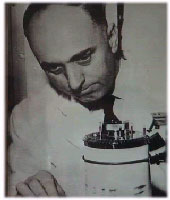 Synthetic Speech

Hold on a sec! Since we're looking for the REAL origin of electronic music, it only makes sense that we go to the source--the guy who actually coined the term "electronic music". And for that we have to go back to 1949, where Werner Meyer Eppler wrote one of the most earth-shattering essays in 20th century music: "Electronic Tone Generation, Electronic Music and Synthetic Speech", outlining the freaky future that popular music was about to undertake as a terrifying warning to all mankind.

Speaking of which, allow me to go on a bit of an aside here: What was with all these brilliant eggheads in the 40s foretelling the future with such grim accuracy? Maybe they were tipped off by the Roswell aliens or maybe--due to the fact that just a few years earlier they had figured out how to blow the planet to kingdom come and were feeling awfully proud of themselves for it--they wanted to do something that would REALLY fuck us up (like nuclear bombs didn't impress us enough. No, really guys. What, were people saying "Pshaw, Any eight year old can slam plutonium particles together and release a biblical amount of energy. Try again, fuckheads." What more did they want, rocket cars and an atmosphere on the moon?).

Anyways, it's pretty strange to see a whole bunch of post-war visionaries--some scientists, most not--accurately predicting future living, complete with technological advancements and all. You got George Orwell, who wrote "Politics and the English Language", detailing the perils of political correctness 50 years before it was canonized. And you got Vannevar Bush, who wrote "As We May Think", which foretold hypertext, miniature cameras and the rise of the internet. Yeah, this guy fucking predicted the motherfucking internet at a time when there were only six computers in the entire world, and four of them only knew how to decode secret Nazi messages, store recipes, and decode secret Nazi recipes and store them. There was also Aldous Huxley, who warned about the "assembly line-ation" of life, harbinging the era of suburbanization and consumerism. A society of Nostradamus', I swear. Why aren't there people like this today? Where are today's visionaries? Was the war generation simply smarter than us? They were certainly better at killing one another.

Anyways, Eppler took his ideas to Bell labs, and came out with what he called a synthetic speech encoder...or a Vocoder for short. And then he went on tour talking about his amazing ideas about this new thing called "electronic music", because everything at this stage was simply theoretical. Like the guys above, nothing they talked about was technically doable yet. But it would be, if they sat around long enough, shut their eyes tight and put their fingers to their temples, and willed it to happen.

So there you go. Werner Meyer Eppler. The founder of electronic music.

## 1929

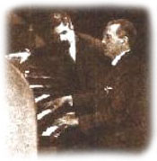 Electric Organ

Actually, that's all wrong. What am I thinking, electronic music didn't start in the 1940s. Stupid me. It started in the 1920s! Yeah. 1929, specifically, is when the first actual keyboard synthesizer was built by Edouard Coupleux and Armand Givelet, only they didn't call it a keyboard synthesizer, they called it the "Givelet Electric Organ", because it didn't have any preset samplebanks or patches or ADSR envelopes or noisegates. But it did have oscillation! Though the oscillation was controlled by paper rolls, like those automatic piano players that have been around since the 1800s, only these paper rolls could control more than just notes. They instructed electronic circuits to control pitch, tone, colour, loudness, and even note articulation. It was a breakthrough in organ technology.

This might have gone down as the most important electronic instrument of all time, except for one thing: four years later, a non-descript company called Hammond, working on a similar premise, released their own electric organ, and the rest is organic history, hahaha. Sorry, bad joke.

By the 60s, Hammond had advanced their product into the B-3, also known as the greatest organ ever made. The skill, quality, competence, and craftsmanship that went into that thing was so extraordinarily high that if Hammond ever tried to re-release the B3 today, it would run retail of somewhere around $60,000. Ahh, but parts and labour were cheaper back then, and for a brief, blissful golden age, it was the king of the somewhat electronic music devices that could actually make decent music. Attach one to a Leslie Speaker, and you got the greatest electronic sound before there was electronic sound. It was certainly better than whatever the musique concrete guys were farting around with. Dumbasses.

Organs are all about size. The bigger the organ, the fuller the sound, the more awe-struck the illiterate church-going masses are when they enter the cathedral, striking real wrath-of-god-like fear into their feeble, mortal minds. Hehehe. But when digital technology came around, it kind of made the art of making really fucking big musical equipment rather pointless. Maximizing acoustics was replaced by the raw power of sheer amplification, and when that happened, organs ceased to have a place in this world. It was like bringing a trebouchet to a fight against a tank--it doesn't matter how good or how big you build that thing, it's not going to win.

But it started here. With the foreknowledge that electronics could improve and probably replace the boisterousness of the gigantic organs. Boy, were they ever right.

[HEAR the Hammond B-3](guide_data/sounds/110.mp3)

## 1917

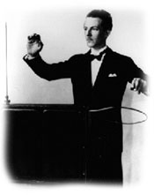 Theremin

Hold on, that wasn't when electronic music started. Go back even earlier, to 1917, when Leon Theremin, a Russian, invented a device that was so fucking weird he couldn't really name it after anything already existing or even anything futuristically existing, since it was so beyond the future, it was like in a parallel dimension. So he named it after himself: the Theremin.

What made the thingamajigger so weird to begin with? Well...for one, you didn't have to touch it to play it. It responded to your body movements, and if you wiggled your hand around in the general vicinity, it would respond accordingly, using your body as a reception receiver. Kind of like the old days when the television set required antenna to pick up signals, and you had to stand in a special spot in the room for crystal clear reception, or else the bloody thing wouldn't work. Secondly, the sound it produced was a completely analogue, real-time, high-pitched alien-like whine, like a microphone feedback squeel, and because it depended on YOU to stand still to play any notes of any discernible length, it tended to waver off a lot because, well, no one can stand completely still. So due to your erratic movements, the thing squiggled around a lot, and I mean a lot, making it sound like a garbled radio frequency dial oscillating to all hell and back. But at least it was electronic.

Because of its unpredictability, music composers couldn't really think of anything useful to do with it. The thing was unpredictable as fuck. How do you even begin to write music for a device like that? Theremin demonstrated the device to the 8th Soviet Congress, thereby allowing secret Theremin technology to fall into the hands of those diabolical communists. Of course the Americans couldn't stand to let there be a Theremin gap, so they raced furiously to find their own Theremin boxes and to frantically find SOME thing to do with them. The answer came 30 years later, in campy, B-grade, pulp sci-fi movies about Evil Things What Come From Outer Space (Klaatu barada nikto and all that), where the Theremin's utterly bizarre noise was perfect for describing the mysterious and the foreign (and the Russian).

But perhaps it's crowning achievement was when the Beach Boys insisted on using one for their 1967 #1 hit Good Vibrations, which took over one year, three different recording studios and twenty different versions of the song to complete because the blasted Theremin was so god damn inoperable. Brian Wilson, fed up with the thing's unresponsiveness, appealed to Bob Moog, telling him to build a more user-friendly one so that they could finish the stupid song already. Moog complied, and the end result is what you hear on "Best of..." Beach Boys compilations today. They should have released the others as remixes.

So here's to the Theremin: the most frustrating musical instrument of all time, and the first entirely electronic instrument, ever.

[HEAR The Theremin](guide_data/sounds/126.mp3)

## 1897

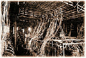 Telharmonium 

Okay, so that wasn't the first electronic instrument ever. But I think I got it now. The first electronic instrument was invented in 1897. For real this time. I'm sure of it. 1897 is when it all began. Nothing earlier. For it was in 1897 that a little thing (which, of course, was anything but little) called the Telharmonium was developed, by a guy named Thaddeus Cahill.

He originally called it the Dynamophone, and it took ten years for him to actually get a working model up and running to produce any sounds, but he filed the patent in 1897, back when he came up with the idea, and by that I mean back when filing a patent for your ideas was more important than actually doing anything about them.

I'm not making this up: The Telharmonium was 200 tons, the size of a hydroelectric power station, and was operated with large levels and gear shafts. It had a massive keyboard with something like 36 keys per octive. 36-key scale! Who the fuck would want to make music with a 36-key scale?! It also had gigantic rivets and pistons and valves and steam coming out of solid iron smokestacks above it. It was truly a masterpiece of steampunk engineering. Amplifiers did not exist back then, so the only way to hear whatever grinding noises it made was to hook up one of those new-fangled telephone things to it and and put the receiver next to your ear. It was like the first Walkman. A Walkman that you could actually walk inside, instead of taking it with you. They later figured out how to play it for rooms of audiences by attaching a megaphone to the telephone receiver. So the sound it made was like a really old, 8khz crappy analog phone conversation. Like someone talking into their fist. This is not ghetto. This is seriously genius stuff for the Victorian era.

In all, three Telharmoniums were made. Being the size of battleships, it took a couple years to build each one. Each one was bigger than the last, too. Everyone was obsessed with size in those days, so they had to be. The last one was finished in 1911, where it promptly hit an iceberg in the North Atlantic on its maiden concerto, taking over 1500 listeners to a watery grave.

They were going to build more, but production was halted by the first World War, and then Thaddeus' ultimate evil master plan of brainwashing the world by filling the telephone airwaves with seductive Telharmonium music, commanding the filthy peons to do his bidding, was thwarted by a much more insidious technology that filled the masses' heads with far more potent drivel: Radio. With the rise of radio and amplification technology in the 20s, the Telharmonium's purpose was rendered moot, forever resigned as the Beta of the electronic music family.

Today, no recording of what the Telharmonium must have sounded like exists, though if you want a general idea, just pick up any generalized Hammond Organ. It was built on the same principal. The last Telharmonium was sold as scrap in 1950, because no one wanted it. Not that they'd want to. Where would you find the room for such a beast, and what would you do with it after the novelty wore off? I guess donate it to some kind of electronic music Hall of Fame museum, if one exists. Does it? Shit, someone should apply for a grant for something like this. It would be awesome! I say it should go in Detroit, because.....well, who's going to argue with that? (shut up, Chicago)

## 1876

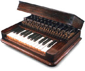 Musical Telegraph 

Dammit, I forgot about 1876. The year everything changed everything. 1876 was the pivotal year that not just electronic music, but electricity and electric inventions in general, would be introduced into people's lives. I've been looking at this all wrong.

1876 was important for two reasons: the first was Elisha Gray. This guy got to the meat of the matter, of what makes electronic music electronic. First, he developed an electromagnetic circuit that discharged a sound. And then, getting the thing to self-vibrate, he made the circuit produce continuous sound. Through careful manipulation using steel reeds (and magic music gnomes) he figured out how to control the tone of this sound, thereby creating the first, basic note, single tone oscillator. This was extraordinary for people who just discovered what to do with electricity a generation before. All that was needed at this point was a simple interface--attach keys to the steel reeds, and viola...the first actual instrument that produced sound entirely via electrical means. He called it the "Musical Telegraph" or "Harmonic Telegraph" or the "Electroharmonic Piano". Jesus, what's with these staunch, stupid-ass latinized Victorian names. The "Teleharmonocinematagramaphone Electroacoustinoscillating Instrumentality Thing!" Hadn't any of these guys ever heard of marketing? I would've called it the "Super Space Piano of Doom". For leisurely sporting purposes of a gentlemanly kind. It would've sold much better. But where did he get the idea to make this self-vibrating electromagnetic circuit thingy in the first place?

He had it in his back pocket for awhile, he just wasn't sure what to do with it. Originally what he was trying to do was figure out a way that, if controlled right, he could use it to make human speech itself travel electronically through a wire to somewhere miles away where someone else could hear it. Far out, eh? He called it the telephone, and he had the idea all laid out, and was all ready to head down to the patent office to claim his role as genius inventor of all time, except he was beaten--by mere hours, no doubt--by Alexander Graham Bell, who kind of beat him to the punch because Bell already had a working model up and running. His wasn't even theory.

But Bell wasn't interested in electronic music, so he sucks. Who doesn't suck, however, was Thomas Edison, who was tinkering around with those very same vibrating circuits and steel cylinders, only instead of trying to figure out how to send sound from one place to another, he figured out how to inscribe it onto a physical surface. Like a book. Only with sound. He called it the Phonograph, and it showed up a year later, in 1877.

That was something no one had ever seen (I mean heard) before. Before 1876, if you wanted to hear music, you had to hire someone to play it. Go to a concert, a live show, rock out, and all that crap. Rave your ass off. There were no downloading mp3s. There was no mixtape trading. All music was live. It was impossible to hear a recording, because the concept of recording music didn't exist. It's a good thing all the classical composers formulated a way to write their compositions on paper, because without the presence of recordable media, all that shit was gone as soon as you heard it. You couldn't play it back or save it for later.

Yet these masters of sound changed everything in 1876. After this year, it was possible to record, play back, stop, move, shift, transport, edit, and manipulate sound to your hearts content. Nothing was out of the realm of musical possibility at this point. Edison and Gray's inventions led to more durable formats of music compacting, stretching, looping, taping and mashing, bringing about the Italian futurist movement, the dadaists, musique concrete, the first ever commercial tape manipulating hit music that charted in Ross Bagdassarian's campy Alvin and the Chipmunks, synthesization of sound and, ultimately, sampling. The totality of musicality in sound. And it all started here. In 1876. For real this time.

## 1761

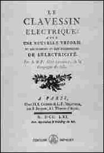 Clavecin Electrique 

Actually, electronic music's origin was really in 1761! Because it was in 1761 (or somewhere thereabouts) that Jean-Baptiste de Laborde invented the Clavecin Electrique, or "Electric Harpsichord". It was more like a kind of a clavichord, only the clappers were charged with static electricity to ring the bells. Don't ask me how this works, it's got something to do with baroque mysticism I think.

Also, in 1761, Johann Maelzel came upon the brilliant idea of creating the Panharmonicon, which was the first mechanical keyboard that, although technically not electronic (it ran on diesel fuel) automated the playing of all the other instruments in the orchestra. Maelzel then went on to design a universal spec for the Panharmonium by which every musical instrument everywhere could adhere to, so they could be hooked up to one another for universal control and compatibility. Where trumpets could play drums and violins could play clarinets and that sort of stuff. He called it Medieval MIDI, and it was a revolutionary concept for the time, but despite its endorsement by larger-than-life composers like Beethoven, it wasn't received too well so Maelzel would have to wait another 200 years before his dream of hooking every instrument up into the Voltron symphony would be realized.

Also, in 1761, Benjamin Franklin invented the glass harmonica, which has nothing to do with electronic music, but it's a pretty useful fact to know in case you're ever on Jeopardy someday. 

And Mozart composed his first symphony in 1761. Of course, he was five years old at the time and his song probably sucked ass (I mean...come on. I wrote my first novel when I was eight. Not that it was any good), and besides, he had help from the evil Earl of Darkwood, kidnapping music prodigies from the 5 5ecret 5tar 5ystems in his quest for immortality.

So yeah. 1761. The year it all began. I know I've said this before, but I mean it this time.

## 1641

 Pascaline 

Okay, so I didn't mean it that time. But that's because I forgot about something that happened earlier: In 1641, mathematician Blaise Pascal, obviously upset at being in Renes Descartes' shadow all the time, attempted to invent something new and unusual that no one had ever thought of before. So he studied things like differential calculus and probability theory, eventually coming up with the Pascaline, a calculating machine which didn't make noise, unless you consider the clickity-clackingness of its adding algorithm to be music which, if you ask the musique concrete guys, might very well be. It was, by all accounts, the earliest (albeit crude) known example of digital logic (though it wasn't digital. More like analog logic). The forerunner to computers, and thusly, electronic circuits and instruments.

Pascal would then use this knowledge to go on and create the Pascal programming language, but his idea fizzled out at the starting gate because there were no computers around for him to demonstrate it on. There weren't even any wall sockets for him to plug a computer in even if he had one. Though I suppose he could cruft together some hacks using a whiteboard and a sharpie, but those didn't exist either. And it's not really fun writing programs on paper. Man, was he ever ahead of his time. Just goes to show that timing is everything. War geeks always talk about how cool it would be to take a modern army back to Ancient Rome and see how they'd kick ass in a battle with the infamous legions of Scipio, but what would you do once you ran out of bullets and gasoline? The only supplies a phalanx needs is food. Without the infrastructure necessary for advancement, upgrading and upkeep, nothing modern would be of very use to past civilizations, despite what time travel movies suggest.

So there you have it. 1641. The very first time anyone had even conceived of the concept of electronic music. Without having to delve very far into electronics or music. There is no possible way anything could predate this.

## 300 BC

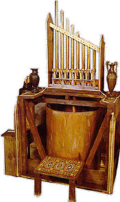 Hydraulis  

Actually, as timelines would have it, there is (sigh). In the third century BC, Ktesibios, a Greek engineer, studied pneumatics and hydraulics and managed to come up with a water-controlled organ that he called the Hydraulis. Using an intricate system of levers, switches, and sacrificing the first-born to the Gods of Olympus, the Hydraulis was the first device that enabled someone to play more than one instrument at the same time.

The Greeks also invented the Aeolian harp, which was the first automatic instrument that played music without needing human input. I suppose they could have also invented sequencers and trackers to get the thing to play what they wanted, but they didn't need to. They simply set the strings at a prescribed pitch and let the wind blow through them, creating music. Essentially, the thing was a nothing more than a dressed-up, fancy, multi-tonal whistle. Big fucking deal, guys. 

Anyways, the Hydraulos was really keen for its day, because it allowed for harmonic complexity and fullness of sound. What makes it electronic music, you might ask? Well....they used water. And water, as we all know, is a deadly absorber of electricity, so it all makes sense in the end. Organs were ultimately the first synthesizers anyway. That's why all modern synths have a keyboard as their native control panel, and not, like....a series of strings or bagpipes or something. Though electronic bagpipes would be pretty keen.

So. That's it. The origin of electronic music. Over 2000 years ago. Amazing how far we've come.

## 65,000 BC

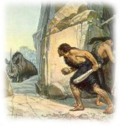 Acoustic Tribal 

Okay, fuck everything I just said. The real inventor of electronic music was Grog, who in 65,000 BC started banging his stick against a rock in a rhythmic, synchronous repetetitetitetive motion, thereby producing the first tribal track. And what, pray tell, is so electronic about that? Well....he was struck by lighting at the time. It really gave an analogue warmth and fullness to his sound.

There. Have I done it? Is this the end? Are you satisfied now, you sophmoric, pedantic fucks? Is your precious little electronic dork IDM history now complete for all to recognize the timelessness of your pompous, "forward-thinking" music? Are you pissed off that I left out the Ondes-Martenot or that I snubbed the mighty Ondioline or Heliophon, and you can't wait to send me a snobbish, pretentious email decrying "CONTINUITY ERROR! CONTINUITY ERROR!"?

You know, sooner or later you conceited tools are going to realize that it doesn't matter who made what or how it came out when. The purpose of music is to have fun and enjoy it and identify with the culture that does, not to flaunt your oh-so-deep and sophisticated air of superiority like a snivelling, skinned-knee school kid who got picked last for kickball. And when that happens you're going to want to stop with the intellectual bedwetting, or else we should just keep on going and just admit that electronic music started with the motherfucking Big Bang so we can pride ourselves on how brilliant and genius we think we are (yes, that means you, Tobias).

We gotta draw the line. Where is that line? I don't know. I don't care. I think this is the first timeline I've ever seen that actually goes backwards, though. Hey, howabout that.

## The Music

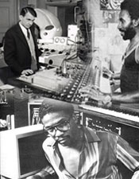 Clockwise, from top-left: Pierre Shaeffer, Lee 'Scratch' Perrey, Herbie Hancock

Now, as for the music itself....pay attention to this part, because I'm only going to say this once.

All electronic music that exists today originated in three principle nerve centres: The Caribbean (Jamaica), the American Midwest (Detroit and Chicago), and Western Europe (France, Italy and Germany). There are other hot points that have contributed lots of good things along the way, like Japan, India, Great Britain, Scandinavia and other areas of America, but chiefly these are the Big Three.

The Caribbean fermented reggae and dub, introduced MCing, exported rapping to New York where it promptly became the most popular music in the world, kickstarted dancehall and DJing, and was the womb of the Breakbeat and Jungle sections of this guide.

The American Midwest enriched us with jazz, soul, RnB, funk and blues, morphed into electro, merged with hip hop, toyed with disco, championed the 'black gay club' aesthete, combined all-night dancing with ecstasy, and was the flowerbed of the Techno and House sections of this guide.

Western Europe cultivated electronic instruments, attracted freaky arthouse intellectual scenes like the futurists, dadaists, existentialists, and beats which all which helped found post-modernism, developed minimalism and musique concrete which transformed into industrial, created spacey film soundtracks, ambient and krautrock, sent disco to America and promptly took it back when America got sick of it, and was the test tube of the Trance, Hardcore and Downtempo sections of this guide.

There. You got all that? Now that you know where it came from, it's up to you to decide where it goes. There is no beginning or end to this thing. Simply dive into the genre of your choice and explore for yourself. That is the purpose of music, after all.

------------------------------------------------------------

# Gear

## Tech 12:*Technics SL-1200 Turntable*

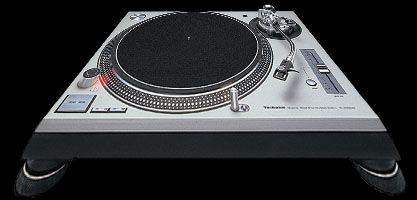

There it is. The wheels of steel. The #1 prime application by which all music is mixed. Plug two of them into a mixer and you got yourself a very expensive hobby. This sumbitch has yet to be largely improved upon since its inception in 1972. Yeah--that's 30 years of being the undisputed, dead solid, ever dependable standard. Eons in an age where technological advancements are just fleeting excuses inbetween more technological advancements. So why is it still preferred after all these years? Because its built like a fucking tank, that's why. I've seen Tech 12s dropped down whole flights of stairs, fallen off balconies, off moving cars, get hosed on, puked on, bottles broken over, set on fire, even buried under 3 feet of sand--and still work flawlessly. The Technics SL-1200 turntable is more reliable and loyal than the family dog. Likened to the AK-47, it was built to last. It never jams, never breaks down, rarely needs maintenance, and its design is so stupidly simple (3 buttons, a knob and a slider) everyone in the industry knows how to use one. It has an average lifespan of 10 DJ careers. You could drop it in a river of molten lava and it would still work. When other tables might sputter or crumble to pieces if you even touch them, the Technics platter can be pushed, back-spinned, stopped, slowed, and manually manipulated to your hearts content, and it will always bounce right back to its regular speed. This durability allows people to practically play it like an instrument, as its solely responsible for the rise of hip hop and DMC battles, and the Disc Jockey as a self-contained musician in his own right.

## TB-303:*Roland TB-303 Bassline*

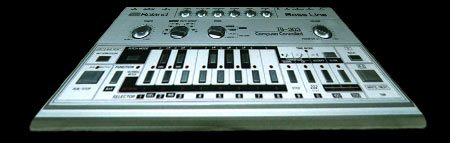

Yes. The sound that launched an entire cultural movement. Given that this device was originally intended to sound like a bass guitar, I would say that the engineers completely missed the mark. And that may have been the best thing that's ever happened to music. This little box (only 30cm long) makes the First Sound of Electronica, and the loveliest, most versatile sound of all time: acid. Through proper tweaking, it can be warm, cold, stiff, funky, dark, happy, soft, fuzzy, trippy, screaming, squelching, driving, pulsing, rubbery, or anything you've ever possibly heard of (and even things you haven't). It can be smooth and bubbly, like a drinking fountain or boiling hot springs. Or it can be cold and mechanical, like an automotive assembly line on the bridge of the Star Trek Enterprise. But perhaps the most important thing about its mutated, alien-like din is that its really really cool to listen to on drugs. That combination--warped acid music and amphetamines--has gone on to spawn the greatest single form of all-night recreation yet conceived of by man.

## TR-808:*Roland TR-808 Drum Machine*

The infamous drum machine responsible for techno, electro, and the entire decade of 80s music sounding all tinny and raspy. The problem with the 808 is that it doesn't sound anywhere close to real drums (was it trying to?). It doesn't have a bassdrum--that sound you hear is just bass, something so deep it makes the cat run around the house in utter confusion. And what the hell is that ticky noise? Is that electronic twerp supposed to be a cowbell? Christopher Walken would not approve. These don't sound anything like.....well, like anything. Yet somehow, this machine released soulless, mechanical hell upon an unsuspecting music industry and, much like all the other equipment detailed on here, was rediscovered well after the company discontinued making them by an electronic arm of musicians who consider those quirky noises happy accidents. 

## TR-909:*Roland TR-909 Drum Machine*

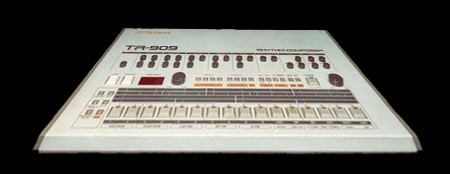

House, trance and techno start here. The 909 is the yin to the 808's yang. Where the 808 is tinny, mechanical, raspy and twitchy, the 909 is heavier (physically and sonically), deeper and fuller. The standard setup is to employ the 909 for the groove, and the 808 for the percussion. The 909 doesn't have a bassdrum--that's just a weird thud emanating from the box that has launched a million dance records. Stick a guitar distortion pedal on it and you have hardcore. Add some decks and effects and you have Richie Hawtin. If there's one great signature sound about this beast, it's definitely the handclaps. The 808 may have the cowbell. But The 909 is ALL about the handclaps.

# Samples

## Amen Break

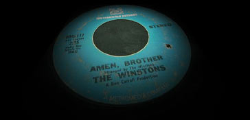

The Winstons were just a soul/RnB group with one hit record: a single in 1969 called "Color Me Father". So what, you think. A one-hit wonder because you wonder how they got the one hit. Yet it was the B-side of that single that contained something strangely extraordinary: an instrumental called "Amen Brother" that was all about its spastic drum solo. And when I say 'spastic drum solo' I mean wave your arms in the air like Grover, make some noise, and get ready fo' da rewind, Boh! My Selectah! Yup. That's it right there; the infamous Amen Break, staple sample of every breakbeat and jungle producer's arsenal. Without this, junglists would not exist.*gasp* God forbid!

## Funky Drummer

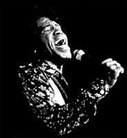

It's not even a very good or popular track. It certainly didn't make any compilations or "Best of..." lists years later. It was just standard James Brown fair, him doing his thing like only he can. It sounds like a track he probably made in the span of about 5 minutes, while making breakfast one morning ("Makin' some hotcakes....gots ta flip 'em over....gots ta flip 'em over...gots ta flip 'em over....hotcakes! Smokin'! With tha bacon on the siiide! aiiiigh!"). Near the end, however, is a very special moment where he tells the band to shut up and just listen to what the drummer is doing. Something very monumental, he notices. A catchy drum riff that years later would propel hip hop and breakbeat to the heights of the music world, and make James Brown the most sampled man in the history of music. For sample-happy artists like The KLF, there was only one thing to do then: snub the Godfather of Soul and rip off Gary Glitter instead. For the rest of the rap world: you niggas owe the hardest working man in show business your bling bling. All of it.

# Sounds

## Hoover

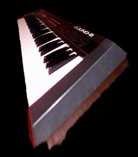

Most every popular sound in electronic music has come about because of a mistake. Nothing is ever made in this music scene deliberately or through conscious, premeditated effort. Everything is discovered by accident, used because it sounds cool, becomes popular, and is ripped off for other tracks, crafting entire genres in their wake. The hoover is the jetfighter wooshing, beehive buzzing, race car driving wall of sound made popular by the Roland Alpha Juno series of synthesizers. Hell, on the Roland Alpha Juno-2 it's listed as Patch-86, titled "What the...". Early on, was referred to as Mentasm or Reese after popular tracks and producers who employed it, but the name that's stuck after all these years is the one afforded by the lowly vacuum cleaner. Ha ha ha.

## MC

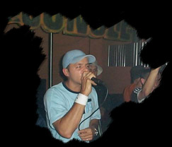

The Master of Ceremonies first got his start as a conductor of sorts, introducing the musical talent and becoming the host of the party. The practice started off fairly benign in--where else--Jamaica, where the MC would add his voice as a freestyle adlib singer, becoming part of the music. Then it was exported to New York where it became Hip Hop, and as time went on Hip Hop MCs decided that they were more important than the music, and then later on declared that they were more important than everything. Jungle and Breaks MCs tried to do the same, with limited amounts of success and bravado. But the important part to remember is that an MC is not supposed to transcend the music or even compete with it. That's when everything goes to shit. The original Jamaicans didn't do that. They understood that the object was to liven the party atmosphere, not to become the centre of attention. They were simply Toastmasters, which is something that modern MCs rarely do anymore. Toasting. I like that word. Who toasts anymore? It seems like every freestyler today is trying too hard to be some sharp-tongues, insult-armed "lyrical assassin" rather than someone who actually wants to improve the quality of the party.

------------------------------------------------------------

# House

House is the most soulful genre. It's also the simplest, the oldest, the warmest, and where electronic music is concerned, easily the most human-sounding, making it the most popular, commanding the most producers, artists, labels, DJs, fans, and subgenres. The whole of top40 pop music gets its hooks, gimmicks, lines and melodies from house music (and vice versa). That is why it stands as the world's perennial party music, and it will probably stay that way until the end of time. Or until someone finds a more catchy beat than the 4/4 bassdrum.

## Stupid: Stupid House
*aka:  Party House, Uk Hard House?!?!? Good God, No* in the Hard Dance group, emerged in 90s

Pretty interchangeable with Nu-NRG, except where Nu-NRG is hard and driving every once in awhile, Stupid House (better known as UK Hard House for reasons unknown as it sounds neither hard nor housey) is just retarded. It's probably the offbeat bass stabs that lend credence to its defining 'stupid' sound. And the horn fanfares, making it sound like silly circus music. And the crowd cheering samples, which make it seem cheap and gimmicky. But where other party music (Happy Hardcore, Eurodance) has a self-aware, tongue-in-cheek affability, Stupid House here legitimately tries to pass itself off as something serious and genuine. Like actual contentious music. A chip-on-its-shoulder, more-hardcore-than-thou ethos, something so laughably ridiculous even Gabber House looks cooler in comparison. Pretending to be what it's not makes this whole genre fraudulent and insulting to those who just want to have a good time. And that's before you see how the kids dance to it. Stupid House is the bargain bin of electronic music. It also encompasses those signature-melody tracks that are always packaged in 'BEST CLUB ANTHEMS EVER' compilations, like The Launch, which are the musical equivalent of junk food. 

## Deep: Deep House
*aka:  Jazz House* in the Funk group, emerged in 90s

This genre is to House music like Superman is to the Superfriends: indispensable. Everything that other House genres can do, Deep House does. Sometimes better. In fact, this genre IS House music. It encapsulates everything House music is supposed to do, supposed to sound like, supposed to make you feel, to a T. If there was no Deep House, House just wouldn't be House. Deep House is the sound that holds the whole genre together. There are several sub-sub-genres of this, all of it good, including Mark Farina's own special brand of Mushroom Jazz. One of my favourites is a really swanky, soulful sub-sub-genre tentatively named (meaning, called only by my friends and I) "Dad House", because it always evokes images of your father walking around the house in his bathrobe on a Sunday morning, reading the paper and smoking on a pipe. Well, mine anyway.

## Disco House
*aka:  Gay Disco House* in the Funk group, emerged in 90s

Of course House wasn't going to leave Disco alone. Even if every track samples the same riff from Change - "The Glow of Love". This is easily the style of music that has the most fun. If there was an official gauge of how much fun something is, Disco House would score off the chart. If there was a country in the world called Funia, Disco House would be its national anthem, as well as the name of its capital city. Everyone would be free, easy, super and gay (that's gay as in happy and fun, not gay as in lame and stupid). I was once walking down the street late one night and a hooker called to me from the curb, asking me if I was looking for some fun. "No thanks, Miss," I replied, pulling out a pair of headphones. "I've got Disco House, the most fun there is." She nodded completely in agreement. "Word. Be on your way, then."

## French: French House
*aka:  Filter House, Tekfunk* in the Funk group, emerged in 90s

In the mid-90s, House was in a major funk. And by funk I mean it wasn't doing too well. Yeah, the primo dance music of the world was struggling with what to do next. Nothing was inspiring, records were weak, a real lull was apparent. And then along come these pretentious Parisian students (oh, but aren't they all pretentious? It is the French, after all. Saying they're pretentious is like saying fat people are overweight). Anyways, along come these French students, who took house music out of its funk by putting it back into the FUNK! I mean it: they literally turned the entire fucking industry on its ear overnight with their special brand of 70s/80s electro porn music house. Stuff so filtered, so funky, and so fresh, they just had to call it French. If anything of value has ever come from France, it's this music right here. At this point, you can't NOT deny the genius that is Thomas Bangalter. He is the only reason why the world does not sack France. 

## Funky: Funky House
in the Funk group,

Yes, officially sanctioned by the Department of Redundancy Department, it's Funky House! Since when is House Music not funky? Well, when it's doing something else, I guess. Still, this and Deep House are easily the strongest genres, because they encapsulate best what House music represents: groovy soul. Well, I suppose there's a Soul House genre somewhere as well, but for the time being all soulful house gets squeezed into here. Or Vocal House. Point is if you aren't moving at least ONE PART OF YOUR BODY RIGHT NOW (even a head bobbing), then you just don't get it. House music is not for you. Go pick up a craft project or something.

## Latin: Latin House
in the Funk group,

And arguments can be made that there is very likely a strain of House for every cultural identity in the entire world, of which Latin House is probably the most proficient since there's so much of it. So until Hungarian Accordian Latvian Mandolin Tapdancing House music makes it big and cracks the top10 a few times, they don't warrant inclusion on this guide. I'm already splitting hairs much too unnecessarily anyway.

## Anthem: Anthem House
*aka:  Stadium House, Arena House* in the Europop group, emerged in 90s

I suppose The KLF are to be responsible for this, when they released their 'Stadium House' trilogy in 89. But more or less Anthem House is really just the less-used, broke-ass cousin of Anthem Trance, evoking images of 'hands in the air' cheering about positively nothing in giant soccer stadiums and british superclubs with thousands of other people who would normally be annoying the hell out of you if you weren't on such great drugs. Gang vocals, cheering noises, and catchy melodies. This is the kind of music that's like really rich chocolate: tasty in small doses; will make you sick to your stomach if you're inundated with too much of it. Trance crackers, take note.

## Epic: 'Dance Mix'
*aka:  Epic House* in the Europop group, emerged in 90s

Pretty interchangeable with Eurodance and Epic Trance, except for one idiot feature: the abject rape and decimation of fine 80s tunes and classic ballads by making trite, derivative "dance" mixes of them. Stupid. Just stupid stupid stupid. Listening to these tunes makes you yearn for the originals way more than you'd ever want to dance in a club to them. From "Total Eclipse of the Heart" to "Keep Me Hanging On" to a cutesy version of the Hamsterdance song (yes, I said HAMSTERDANCE, fuck dammit. Go P2P for it yourself, and brace yourself for the horror of horrors). If there is any redeeming feature of Epic House that exists, I haven't seen it yet. This genre is absolutely shameless and without remorse. It is a gimmicky vehicle for cheap radio one hit wonders through upgraded nostalgia, and is completely devoid of originality, substance and value whatsoever. Whoever makes this shit should be shot.

## Eurobeat
in the Europop group,

With Jpop and Eurodance as its parents, Eurobeat is truly in a class of its own, with maybe Happy Hardcore as its stupid step-sister. Unlike other genres, Eurobeat knows what its limitations are. It's not trying to save the world or convert everyone over to its spastic, sped-up euro disney cheese. It doesn't foster any illusions about its tweaker formula and erratic sensibilities. And for that you kind of have to respect it. It's role is to be the background music for funny fitness competitions on TV, and it's perfectly happy with that. It's also good wakeup music.

## Eurodance: Europop, Euro, Club House, Handbag
*aka:  Eurodance* in the Europop group, emerged in 90s

The reason why it's called Handbag in parts not American is because girly flocks wearing tight capri pants and tube tops or something would colesce in clubs to dance to this music around piles of their purses and handbags on the dance floor. I've never actually seen that happen, but it's certainly believable. Eurodance is the undisputed king of creative cheese: that is, cheesy dance music that is far from annoying. It's dedication to silly, spastic fun, with buff dancers running around and funny raps about dancing, love, and the love of dancing has made an artform out of the lighter side of music. Where other genres in the same vein failed due to their pompous delivery and overblown self-important schmaltz, Eurodance got it right: pop music as it is, was, and should be. Nothing more.

## Happy: Happy House
in the Europop group,

The official music genre of Dance Dance Revolution, this is by far the most syrupy, saccharine music known to mankind. I bet they play this kind of stuff to calm lunatics at insane asylums locked in padded rooms with pink walls. Bubblegum pop so childish, with lyrics so inane and non-sensical that you can't possibly take it seriously, so it's best that you don't. Just keep nodding politely, and step away carefully, with slow, controlled movements. Or the Japanese schoolgirls might sic their giant robots on you.

## Jpop
*aka:  Shibuya-Kei* in the Europop group, emerged in 90s

Is anyone even surprised that this kind of stuff would come from Japan? That whole country is like Bizarro world. They do everything we do, just in a really strange way. It reminds me of that scene in "Who Framed Roger Rabbit" where they go near Toontown, and you can see clouds of smoke and yelling and fighting and all sorts of haywire shit happening above the horizon to signify the complete and total lunacy of the place. Japan is just like that. The whole world continuously scratches its head at the far east, then sits back and watches to see what wacky thing the Japanese will do next. I mean, I'm sure the culture is swell once you get past all the incest and pedophilia and giant robots and all, but after that--huh? Japan is super crazy place, 100 PERCENT! Note: there's actually two forms of Jpop. The faster kind which gives the hardiest Dance Dance Revolution masters a run for their money, which is indistinguishable from Eurobeat, and the more bubblegum kind, called Shibuya-kei. You can tell which is which.

## Nu Italo
*aka:  Nu Italo Disco* in the Europop group, emerged in 90s

Not really an upgrade of 80s Italo Disco, but its made in the same place, so I guess the name is appropriate. Slower, thicker beat than Eurodance, but its signifying and most addictive feature is the VOCODERS!! Love those lovely, oscillating vocoders! You can never have enough vocoders. Hell, the whole reason why most of the songs don't have any actual lyrics but just nonsense human melodies (la da bee dee doo da lee da) is because they sound so cool with vocoders. Rediscovered by Daft Punk legend Thomas Bangalter (the purveyor of everything 80s), used lavishly by everyone in his wake. This genre has had one monster hit: Eiffel 65's "Blue", but just because it's way overplayed doesn't mean you should discount the entire genre. There's some wicked-ass stuff here.

## Vocal: Vocal House
*aka:  Diva House* in the Europop group, emerged in 90s

This can pretty much be any of the other genres, really. What makes it Vocal is, well...vocals. Not just any vocals but loud, dominating, high-class crooning ones by diva songstresses. That makes this genre pretty hit and miss, depending on whether the diva is any good or not, or whether she annoys the hell out of you (which can happen with alarming frequency, believe me). For what it's worth, I tend to think that house classics have the best Divas, as the modern stuff has way too much of that insipid octave modulating RnB crap like a bunch of Destiny's Child rejects. Can you just hold a single note for longer than a fucking second, you stupid tarts?!?!?

## Techno Dance
*aka:  Techno* in the Europop group, emerged in 80s

And then all of a sudden, without word or warning, electronic music was granted mainstream acceptance and exploded all over the pop charts. It was like a revolution, and everyone hitched onto these power pop tracks with silly raps and cooing divas. Fuck, I remember dancing to Snap! in my grade 7 school dance. The public accepted everything, calling it all Techno for some reason. This genre didn't really have a name--then or now. Everyone called everything Techno so it was hard to place the evolution, origin or progression of any kind of set sound or music. So I put it all in here, and call it Techno Dance, even though it's more Dance than Techno, and not really either. It's a shame that most ignorant people still think of this music when they hear the word "techno".

## Italo: Italo Disco
*aka:  Italo* in the Eurodisco group, emerged in 80s

There was a big backlash to everything Disco in America in 1980. In Europe, this didn't happen, so Disco naturally progressed over there to what it had been hinting at for several years: a stripped down, mechanical version of itself dubbed Italo Disco for reasons unknown as very few of the artists were actual Italians. But they all sang in english, which is odd because english was universally a second language to them, as evidenced by the fact that the lyrics make no sense and the vocalists have thick accents of indeterminate origin. Still, despite these shortcomings, the music kicks ass, and is recognized as the world's first completely electronic commercial dance music, predating House, Techno, Electro, and just about everything else. The music is seriously stupid good fun once you get past its dated, tinny sound. I now have ten times more of this music than any other genre. And I might very well start spinning it too. No, I'm serious. You don't believe me, do you?

## New Wave
*aka:  Electro Pop* in the Eurodisco group, emerged in 80s

As in a new sound, a new mode, a new type of apparatus from which to construct, compose, and perform music. What I like best about this period is everyone who picked up an electronic instrument did so because they were already established musicians and composers looking for additions and enhancements and explorations of their sounds. Today, electronic musicians--especially the bad ones--seem to be mostly lazy, uncreative morons who don't know a damn thing about music because they let the sequencer and preset banks do all the work. It's no wonder that the music 20 years ago still sounds way more interesting than it does today.

## Synthpop
*aka:  New Wave Part 2* in the Eurodisco group, emerged in 80s

You BETTER KNOW what this is, otherwise you have no conception of the oddity that people ironically giggle about called "the 80s". Taking the explorations of New Wave and the feelgood rhythms of Italo Disco, Synthpop--in all its androgeny--makes as warm a sound as archaic 80s electronic instruments can get. Melodic hooks, pop lines, all the tools of the trade are there, only this time with synthesizers. MIDI definitely contributed to this explosion. And now its undergoing a renaissance due to the almighty power of Retro. But its crowning moment will always be the Carnival scene in Revenge of the Nerds, proving that the geeks and social outcasts were, are, and will forever be the ones spearheading modern cultural movements. I personally feel Italo is way better though.

## Disco
*aka:  Electro Boogie* in the Eurodisco group, emerged in 70s

Not just any Disco, but electro boogie! The synthesized direction Disco was heading after its flame was extinguished by American meatheads. Trivia time: the last Disco track to reach #1? Lipps Inc.'s "Funkytown", May 1980. And by then synthesizers and drum machines really started coming into their own, as shown by the track's stark contrast to the big-band, string-section, entire-ensemble disco cuts that permeated radio waves 5 years earlier. Machines allowed making the music easier, faster, and cheaper, but they also brought on a whole bunch of other things. The 80s proved to be the coming-out party for electronic music, as within a year of Disco's infamous backlash everyone, from Reggae (Eddy Grant) to Funk (George Clinton) to Jazz (Herbie Hancock) to movie soundtracks (The Warriors) would employ electronic instruments with glee. As for Disco--it moved to Europe and became Italo Disco.

## Acid: Acid House
*aka:  Acid, Oldskool Acid* in the Chicago group, emerged in 80s

Raves weren't actual raves until this came along. 1988, the Summer of Love, the Hacienda, Shoom, Heaven, and all that. Well, first they were called acid house parties, then they were raves. The music itself is actually pretty moody and sinister compared to today. We always think of the music at parties to be upbeat and energizing. I think the whole motif of this evil-sounding, mechanical 80s music in dark rooms with minimal lighting and hundreds of people squashed on drugs swaying about like automatons to be quaintly cool. Of course, at the time this must have freaked out the suits. It would've freaked me out too. It's definitely lost its edge since those seedy days. Rave-oriented music now is just too warm, receptive, and pleasant-sounding to give its origins any justice. 

## Classic: Classic House
*aka:  Chicago House* in the Chicago group, emerged in 80s

It's antecedents include funk, soul, blues, jazz, disco, dub, and sometimes even hip hop, but none of that is here because it isn't electronic (unless specified specifically). Still, no genre is an island, and it had to get its inspiration from somewhere. Like, say someone banging a stick on the edge of a wooden box or something. The music's really been around for 40 years (if you don't believe me, go listen to the Jazz Crusaders), the drum machines just make things more groove-centric. Which is a good thing, owing to the highly-convoluted social phenomenon that was about to emerge from this thing. 

## Garage
*aka:  New York House* in the Chicago group, emerged in 80s

Around the same time that gay black people were inventing House in Chicago, gay black people were inventing Garage in New York. It makes you wonder if gay black people in other cities weren't doing similar things, like maybe 'Shack' in Indianapolis, or 'Toolshed' in Des Moines, or the uptempo, swanky, soulful 'Apartment Complex' coming out of Cleveland's urban underground. Where House brings the funk, Garage brings the soul, as it sounds more organic and 'disco-y'. Scientists have still yet been able to figure out what makes its spin-off genres 2-step/UK and that godawful 'speed' stuff actual Garage, since they've both been disowned from conception.

## Hip: Hip House
in the Chicago group,

It's more popular than you think; people are just wack bitches and don't give it their props like they should. Some of your favourite top40 hits you remember getting down to at your Bar Mitzvah or Prom or Commencement or whatever lame dance you thought was cool back in highschool were actually house remixes of rap songs, or rap remixes of house songs, or a forethought meshing of both. Making them Hip House. Come to think of it, most modern rap (Dr. Dre comes to mind) is employing a steady house beat these days. I don't hear much scratching in rap music much anymore. Is hip hop truly dead?

## Booty: Booty House
*aka:  Parental Advisory: Explicit Lyrics* in the Booty Bass group, emerged in 90s

Every song will contain one or more of the following samples: "If you got a bigger booty, come on down and do your duty", "Let me see your booty bounce, booty bounce, booty bounce, let me see your booty bounce, booty bounce, booty bounce", "Awe girl, you think you bad. Let me see you shake dat ass", "Let me hit it from the back, and I give that ass a smack", "Face down, ass up, that's the way we like to fuck", "Hold up!", "Wait a minute!", "Uh-oh!", "There some hoes in dis house, if you see 'em point 'em out", "Whoomp! There dem hoes", "Just shake dat ass bitch, and let me see what you got". 

## Dark: Dark House

It seems to be a domain largely of "progressive" (read: Brit House) producers who don't want to be too pretentious. More characteristically, though, it seems the whole of western popular music itself has turned very passionate (which is to say, tragic and somber), moody, abrasive and short-fused in the wake of the terrorist attacks, not just electronic music. Even a happy-go-lucky genre like house couldn't help but feel somewhat sinister and serious for awhile. That's where this music comes from. Even if the concept of "dark house" is like a water-repellent sponge.

## Hard: Hard House
*aka:  Real Hard House, Chicago Hard House*  emerged in 90s

Yeah, there we go. Real _FUCKING_ Hard House. To even remotely hint at suggesting that Hard House is some other kind of limp-wristed pussy circus music makes you ridiculously dumb. I mean it: you are really really DUMB for fostering the delusion that Hard House should be anything other than.....HARD. A distorted 909 bassdrum is what you need. And some courses on how to properly focus your anger management, and hopping around pumping your fist in the air. 

## Microhouse
*aka:  Minimal House, Glitchy Tech House*  emerged in 90s

Tech House artists decided to expand their sound into ever more monotonous soundscapes when they decided to create Microhouse: A minimal version of itself not unlike Minimal Techno......only housey. It actually floundered for a few years, narrowly escaping a bitter lawsuit with a software company from Seattle, but lately it's been getting a lot of interesting press more or less because the Glitch guys (like Akufen and Matthew Dear) stumbled upon it and began applying it's sparse aesthete to their clicks and cuts. It now doesn't sound half-bad. When it's sounding like anything at all. Why is it called Microhouse? Because it really IS Micro! The kickdrums, the snares, the hi-hats all sound really compacted and tiny-like, unlike the big booming bassdrums of its brethren genres.

## Progressive: Progressive House
*aka:  Progressive House*  emerged in 90s

Alright, this progressive nonsense has got to stop. You do not make yourself intelligent and creative by using that word. Instead, you make yourself out to be haughty and pretentious. That makes you no better than the french. This goes for progressive rock, progressive house, progressive trance, progressive progress, and even progressive itself. Kill the word already. It means nothing. With that said, Progressive House is a genre originally coined by Genesis P'Orridge to describe the early 90s sound made by artists like Leftfiend (actually, only just Leftfield), which was not quite house and not quite techno and not quite dance. In truth, it really just sounded like house with (then) trancey elements. Not trance with housey elements. I don't know what it meant after that (probably Progressive Trance), but that doesn't mean you can hi-jack the word now and call yourself forward-thinking. Especially since the genre is STILL BEING MADE (the 'X-press 2' track came from 2002, not 1992). There's a lot more to music than trying to look and feel important, trancecrackers.

## Speed Garage
*aka:  The Worst Music In The World*  emerged in 90s

How did this music get past the censors? Who greenlighted this project at the Official Electronic Music Genre Standards and Classifications Consortium? I'm still at a loss as to what it's trying to do. Is it funky? No. Those dulled basslines sound like someone farting into a pillow. Or like the school teacher in the Charlie Brown cartoons scolding some child for his inability to spit, sing and gargle at the same time. Is it soulful? No. Time-stretched vocals never had any appeal, ever. There's no real hook, no real melody. It doesn't even pay any decent homage to Classic Garage. So what the hell is this stuff doing?! Sucking, by the sounds of it. But as bad as it sounds, it has actually managed to find a way to get WORSE over the years, dumping the time-stretched vocals in favour of......you guessed it: those annoying, crooning Mariah Carey wannabe diva hooks. Oh, fucking hell.

## Synthtron

You know a genre is really popular in the music press when it quickly garners more names than it does actual artists or labels. The reason for this is because every major player in the music press wants to lay claim to discovering something so kitsch and trendy by giving it their own pet term for it--a foreshadow of things to come as music continues to fragment into social niches. I am no different, which is why I call it 'Synthtron', because Electroclash sounds like the stupidest name I've ever heard. Though it may more be appropriately applied to the grittier, guitar-infused punk artists (Chicks on Speed, Fischerspooner, Add N to (X), Orgy), I can't see it being a justifiable term for their House-bred contemporaries (Felix da Housekat, Miss Kitten and the Hacker, Ladytron, Adult., Who da Funk, Northern Lite) who are, once again, following the wake of pioneers Thomas Bangalter and Les Rythmes Digitales, who were spearheading this retro 80s trend back in 1996. Heh. Synthpop with upgraded equipment. Who could've seen that coming?

## Tech: Tech House
*aka:  Techno-House*  emerged in 90s

You'd think that a hybrid genre combining the best qualities of House and Techno would be totally rad, but it's not. In actual fact, Tech House comes out mostly as a dull, monotonous drone (something Tech House was the undisputed king of until only recently, when the technique of making boring music was surpassed by the pretentious Brit House scene calling itself only "progressive"), with barely enough going for it to make it interesting. It's like it decided to combine the worst qualities of Techno and House. Why the hell it would do that, I don't know. But it's been around, like, forever, and people keep making it, so someone somewhere has to be listening/buying/dancing/spinning all those Tech House records. I have yet to find anyone though (Tripwire, shut up).

## Tribal
*aka:  Tribal House*  emerged in 90s

I'm probably splitting hairs here by describing each and every flavour of tribal when it could be much more easily sorted out as just one percussive whole, but some people have really narrow tastes, so this guide is not for them. Tribal House is mostly a west coast thing, where we still have trees out here for hippies to hang out in and throw free parties in the forests during the summer (when the weather cooperates). Plenty of bongs and bongo drums for everybody. 

## Dub
*aka:  Dub House*  emerged in 70s

This kind of stuff's been around at least for 30 years. Take reggae, remove the lyrics and harmonies. What you have left is what those lovable Jamaicans like to call the dub. Yeah: Dub. Sheesh, sounds like one of those pet words stoners always come up with in their spare time. Add a beat to it and it becomes Dub House. It was the first ever tool for DJs--a groove to lay down under all the anthems and floorfillers--somehow making it a genre in its own right. Now it's influenced everything else as well. There's probably a million and one sub genres of this--ambient dub, techno dub, dub dub--but I'm too lazy to find out what they got going for them. But god bless those wacky Jamaicans and their wonderful detail to rhythm.

## Brit: Uk House, English House, Not Progressive
*aka:  Brit House*  emerged in 00s

It's almost as if England (and maybe Europe as well) had been collectively stuffing its face full of sweet, syrupy, cavity-inflicting cookie cutter McTrance for 3 years (96-99), and then suddenly got sick to its stomach and threw it all up. Or maybe it was just Britain's major DJs who got sick of the anthem schlock, and vowed never to spin it ever again. And appropriately, where they commanded, the people, like polite little sheep, obeyed. Then Sasha and Digweed and their ilk wanted to be taken seriously so they started moving into...this sound. Whatever you want to call it, it doesn't matter; it serves its purpose, which is to be anti-anthem. And then as if to REALLY show everyone how above-it-all they were, they gave it a really pretentious name out of an adjective: Progressive. Progressive what? Fuck if I know, after 3 years trance snobs are still arguing over that part. Since it means absolutely nothing, then, I'm calling it Brit House, because if anyone could make house (trance?) music this boring and monotonous, it's the British.

------------------------------------------------------------

# Trance

Trance is the most emotional genre. It can make you cry, make you shout, make you cheer, and make you celebrate absolutely nothing of substance except pure, ecstatic bliss. This is interesting, when at one time it was very repetitive and hypnotic (hence its label 'trance') and was very easy to get lost in whilst divulging in aforementioned emotions. But now it's quite difficult to get entranced due mostly to the fact that the genre has devolved into such trite, derivative junk that even the biggest culprits of it are having trouble lying about how interesting it is. If you ignore the cliched, breakdown-build-anthem template side of the genre that is so canned and predictable you can set your watch to it, trance is still pretty fun. Unless you're trying to be a Sasha worshipping pretentious snob not partaking in that, in which case you don't even want to admit you're listening to trance anymore.

## Buttrock Goa: Heavy Metal Goa
*aka:  Buttrock Goa* in the Psy group, emerged in 90s

There's enough sub-subgenres of psychedelic-goa-israeli-mediterranean-middle eastern trance (ie: anything not euro, which inherently makes it far more interesting) to warrant its own trance section altogether, and in compliance with the true ethos of trance it should very well get one. And maybe someday it will. But for now, I'll just list my favourites and/or most prominant ones. Psychedelic trance envelopes all of that. And Buttrock Goa is easily the best one. Heavy metal and trance go so well together.

## Death: Death Trance
in the Psy group,

Dark Trance and Death Trance are pretty interchangeable. The only real difference (and it's a minor one...oh, but isn't this entire guide?) is that Death Trance artists seemed to be ported over from Hardcore a lot, whereas Dark Trance artists are ported over from Goa. But not always. Speaking of Goa, this music sounds a lot like it and can be mixed with it really well, and it scares the hippies away too, so it gets the big*thumbs up* by me.

## Goa: Hippie Trance
*aka:  Goa Trance* in the Psy group, emerged in 90s

For what it's worth, the only trance genre that still has some integrity left. Goa is just too complicated, too dark, too brooding, and too ominous to ever have popular appeal, and it's doubtful that it ever will....and that's just the way hippies like it. Imported from India, duty free, where it is so hot the DJs don't even bother mixing or else their faces melt off (and that's BEFORE you drop acid). There are a million and one splinter genres to this too (hard goa, progressive goa, psyfunk, ambient goa, etc...), but I'm only putting down the most prevalent. As for the rest, it's terrific stuff, if all the annoying, superficial hindu and buddhist iconography doesn't annoy the hell out of you. Goa would be the best genre ever, if it weren't for the fucking hippies.

## Psychedelic: Psytrance, Psychedelic Goacore
*aka:  Psychedelic Trance* in the Psy group, emerged in 90s

The difference between Psychedelic and Goa Trance is really negligible, and if you ask anyone involved they'll readily say that there is no difference, much the same way that junglists will say there is no difference between Jungle and Drum n Bass (even though there is). To put it succinctly, Psychedelic Trance removes the hindu/middle-eastern influences and melodies and full-on blasts you with mindfuck music...teleport zappers, star trek tweeps, nintendo twerps, theremin squeels, feedback hums and radio antennae frequency squelches. Well...Goa might have all that stuff too. Hmmmm. Let's say this instead: Goa is more organic, and Psy is more cybernetic. But they're both futuristic sci-fi music. Okay, fine: they are the same damn thing. But there's just so much good music here to only squeeze in one genre. And if you think I'm done here, wait until you check out Psytekk. It's like HR Giger on acid.

## Psytekk: Minimal Psytrance, Augh!!!!!!!
*aka:  Psytekk* in the Psy group, emerged in 90s

Psychedelic Trance isn't total horror. In latter years it actually came to be pretty goofy stuff, with the most bizarre samples inserted, like babies crying, people burping and sneezing, and other avant-garde musical interludes. The less sensible, however, ventured into this sonic territory, and I have to tell you: this is, bar none, the most evil, depressing, gut-wrenching, "no hope for mankind's impending war against the machines" music in the world. Like most genres, best--and also best for your acid trip--in small doses. But subject yourself to a whole night of this terror and you'll WANT the madness to leave your head by the morning, and you're damn prepared to end it yourself with your brain firmly smushed into the nearest brick wall. I sincerely think this is a secret government torture weapon that accidently escaped to the public. No one can be this sadistic, can they?

## EBM: Ebm
*aka:  Electronic Body Music, Industrial Dance* in the Industrial group, emerged in 90s

Ah yes, here we go: Electronic Body Music. Almost like proto-goa, in its straight-ahead, buzzing synth aesthete. Industrial's true connection to trance, which is why the rest of the genres kinda got dragged with it in this mangled mess of a music genre node. In its raw form here, it's pretty mean, impersonal stuff. I'm not sure how some people can insist that trance is peaceful, euphoric angel music. That's like saying Charles Manson is the next Mother Teresa. Machines don't have feelings, and neither does trance.

## Electro Industrial: Electro-Industrial
*aka:  Agro-Industrial, Post Industrial* in the Industrial group, emerged in 90s

It might be EBM with breakbeats (sometimes), or it might be Industrial with more updated equipment, capable of taking abrasiveness and filtered vocals to the next level of brooding angst. Technically this came way after EBM, but I'm running out of room as it is. This is what became of real Industrial music in the 90s, which means ixnay on the uitarsgay in order to separate it from its massively popular cousin Industrial Rock.

## Futurepop
*aka:  Futuresynth, Industrial Synthpop* in the Industrial group, emerged in 90s

You know how when you meet someone from another geographical region, they have a funny accent? But to them, you're the one who has the funny accent. Well, in the great mess that is the music of Trance, Futurepop has the same kind of polar opposite perceptions based on one's musical background. To the Industrial/Goth community, Futurepop is cheesy, silly commercial pop music, a blend of the straight-ahead driving synths and treated vocals of EBM with the flying strings of euphoric Epic Trance. But to the Epic Trance scene, Futurepop seems at once impersonal and harsh, a product of the dark, brooding Industrial scene that is disdainful to their sensitive, trance attuned ears. Since that's the case, then Futurepop may very well be the greatest Trance genre ever. Even better than goa.

## Coldwave
in the Industrial group,

Coldwave is really pissed off about something, but I'm still trying to figure out what that is. It basically takes the angst of Darkwave and turns it up a notch (where Darkwave takes the angst of Goth and turns it up a notch). So this is like Goth...TO THE EXTREME!!! But it loves using acid, so it can't be all bad. And it loves using guitars, being a stepping stone to the more commercial-friendly Industrial Rock.

## Darksynth
in the Industrial group,

Essentially, this entire branch of electronic music really had three distinct origins, all of them not entirely electronic but evolving and criss-crossing each other often: Goth, which was gloomy, morbid romanticism; Industrial, which was abrasive, raw angst, and this--the 'synth' stuff, which was pretty damn apathetic at times, though it would frequently get upset at the other two for being so damn melodramatic. That doesn't mean it didn't have its fun, however. It just thinks the other two whine too much.

## Darkwave
*aka:  Electro-Goth, Industrial Goth* in the Industrial group, emerged in 80s

Everything was "wave" in the 80s. There was New Wave in pop music, and then No Wave in punk music, and then the Third Wave of Alan Toffler, and then there was the New Wave of British Heavy Metal, and also everyone's hair had impressively feathered waves in it. It was certainly a time of waving (it took them awhile to change the 'w' to an 'r'). So when the goths finally decided that their melodrama would work really well with machines, of course they called it Darkwave. They probably wanted to call it Blackwave, but that.....hey, why didn't they call it that? I guess it beats calling it Electro-goth (some people might tell you there is a difference between the two genres, but don't listen to them). Lately, it has splintered into regional styles, like Euro Darkwave, and American Darkwave, and man, they are amplified trauma on a whole different, unheard of level. I swear, they make Linkin Park and Evanescence's bellowing about stupid insignificant shit sound like pillow talk. 

## Experimental: Industrial Experimental
*aka:  Experimental Industrial* in the Industrial group, emerged in 80s

Industrial music is already pretty much experimental music to begin with, but wouldn't you know it--they had to go out and be experimental themselves. So this is like Experimental Experimental music. Like....experimental squared or something. It's not quite known whether you can actually hear the added experimentalness in the music that makes it more experimental than other experimental genres--unless you have specialized experimental-attuned ears for it. Because it just sounds like every other experimental genre....just experimental industrial. This sounds really stupid, doesn't it?

## Indistrial Rock: Industrial Rock
*aka:  Industrial Metal* in the Industrial group, emerged in 80s

Ah yes, Industrial Rock. The form of Industrial that has had the most commercial success, and it's all Trent Reznor's fault. Just like how it's all Morrissey's fault there's emo. Heavy metal (and metalheads) needed somewhere to go after grunge nearly crushed it out of existence, so they latched onto this like it was, well, the Next Big Thing. It doesn't differentiate from Coldwave much, except that the songs are more pop accessible. I guess you could call it Epic Industrial then. Ha ha ha. The music's actually not all that bad. The artists have all been featured on Mortal Kombat compilations at one time or another, and they have a tendancy to brainwash troubled teenagers into shooting their classmates every now and then, but other than that it sounds alright to me.

## Goth
*aka:  Goth Rock, Trad Goth* in the Industrial group, emerged in 70s

Technically not electronic music, unless you count it's giddy use of sound-enrichment studio techniques to give those wailing choruses that extra level of self-deprication and despair. Goths are not happy people. In fact, next to emo kids they are just about the most self-centred, whiny bunch of neo-narcissists on the face of the earth (if you're wondering what the difference is: classic narcissists go around telling everybody how awesome they are, while neo-narcissists go around telling everybody how awful they are). This doesn't mean you should hate the music. Far from it, it's actually quite snappy and fun. Just don't take it too seriously. The style is fine, but there are more colours in the world than black, y'know.

## Industrial
in the Industrial group,

Genesis P'Orridge must be the most quotable man in modern music. Seriously, everything that guy says turns into a de facto music industry declaratitive term for all time. He got his start in the 70s forming the band Throbbing Gristle (what a great name!), releasing music on his own label, called 'Industrial Records'. That word--and the label--would go on to become synonymous with all abrasive forms of music for the rest of the century and beyond. Then, later on in the 80s, he forms his Psychic TV project and begins toying with the TB-303, christening the new sound "acid house". The name stuck. Then, in 1992, he's asked about the kind of music coming from artists like Leftfield. His response: Progressive House. Man, is there anything that guy doesn't say that isn't so catchy and applicable? If I were a marketer, I would follow him around every day and bottle whatever he says and sell it.

## Hard: Hard Trance
in the Hard Dance group,

Now this one is odd. It's hard, but at the same time it's not hard. Summarily put, Hard Trance is yet another refuge for fleeing souls of the Anthem comedown at the turn of the millenium. The funny thing is it has actually picked up "hard" anthems since then, so the new arrivees won't feel at all estranged by this --intense-- music. Personally, I think if you have to abandon flighty emotional stuff for a harder edge in order to get people to take you seriously as a musician, you probably aren't a very good one. This music will probably be made by mad-libs computer programs a generation from now (if it isn't already).

## Hard Acid: Hard Acid Trance
in the Hard Dance group,

Hard. Acid. Trance. It's kind of actually like Goa, only without all the hippy shit. That makes it better by default. Pretty interchangeable with Hard Acid Techno, though the major difference seems to be where this genre seeks to fill dancefloors, the techno variant will scheme ways to FLATTEN dancefloors. Either way, they are the twin masters at making the little 303 box squeel with glee. Like Progressive Trance's patenting of the breakdown-build-anthem formula, Hard Acid Trance can also lay claim to a similar-styled gimmick for quick, cheap, instant acclaim: the "drop the music for one or two bars, and then bring it all back motherfucker" technique. And like Progressive Trance, the formula was used credibly here, but then overused to the point of ad nausium by its offspring--namely, NRG.

## NRG: Nu Nrg, Hard Nrg, Hard Dance
*aka:  Nrg* in the Hard Dance group, emerged in 90s

It's actually really decent in small doses. Being forced to endure an entire set of it will grate on you, however, and having to go through an ENTIRE NIGHT of it--as I was victim to, many many times--gets excruciatingly mundane. The problem is the music just doesn't let up--ever--and no, you stupid ravers, that is not a good thing. Parties build on tension and release; NRG's go-go-go ethic just flatlines the entire experience, with track after track after track of the same idiotic shit. There are a group of genres that pride themselves under the monicker Hard Dance (which includes Happy Hardcore, Trancecore, Freeform, and Stupid House) and are harbingers of a culture infatuated with its own attitude that, given the chance, will set your teeth on edge even more than the music will. Best to just ignore them. They're too high on crystal and nordic-tracking to NRG music to pay much attention anyway.

## Hardstyle: Really Hard Trance, Hard Dance
*aka:  Hardstyle* in the Hard Dance group, emerged in 00s

As what usually happens in the creation of new genres, you take one specific thing that makes another genre cool, and revolve your new genre entirely around it. So this is what happens when artists go "hey, that thunderous beat and bassline and squelching synthline sounds really cool". Whamo, there you go: new genre (or nu, I should say). Eventually, Nu Style Gabber producers started noticing it, so they dived right in, thinking "hey, no problem. We can make this shit too." What's the difference between them? About 30 bpm. Play your Nu Style Gabber records at -8, and Hardstyle is born. But it's still not hard enough to be included among the Hardcore genres. Though maybe that Hard Dance subgroup.

## Anthem: Mctrance, Stadium Trance, Arena Trance
*aka:  Anthem Trance* in the Eurotrance group, emerged in 90s

Progressive Trance actually had a pretty good idea. There's nothing wrong with some tension and release in your song. That's what people listen to music for. To bring the music down to a crawl before exploding out with a crescending climax is one of the best tricks in music. And besides, if the DJ's too stupid and inept to figure out how to provide adequate tension and release during his sets through careful track selection and record management, why not do it for him, essentially removing any skill he thought he might've needed to have in order to be a good DJ. Breakdowns, builds, and memorable melodies are not a new thing in trance. But what Anthem Trance did was completely and totally abuse and pervert them. Where Progressive Trance used them to somewhate accentuate the moment (like say a lull before the main synth kicks back in), Anthem Trance used them for the track's entire purpose. This cookie cutter, by-the-numbers formula dominated the english club scene and trance, once the quirky kind of music with only a niche market, reformed itself into a neverending series of pop jingles and by doing so supplaunted house as the most popular dance music in the world.

## Dream: Dream Trance
*aka:  Dream House* in the Eurotrance group, emerged in 90s

If there is anyone who is responsible for the complete and thorough pussification of Trance, making it offensively lame to the point where not only newbie ravers but also their soccer moms could enjoy it, it's Robert Miles. "Children" has the exclusive accolade as being the #1 rave recruitment song of all time. It's also probably responsible for the embarrassing onslought of banal, melody-driven trance that dominated the last half of the 90s. Hell, I remember Anne Savage playing this fucking song at my very first rave. This isn't trance; this is like that crappy background music on the TV listings channel that tells you what's playing on other channels.

## Epic: Epic Trance
in the Eurotrance group,

Epic Trance is the gateway genre into the world of rave for most people, so if you have any form of music to blame for raves hitting the mainstream, this is it. Right here. And that, my friends, really, truly, terribly sucks. There must be a word to describe the pain one feels when witnessing (or hearing, rather) something once pure and brilliant completely sold down the river. Sometime in the mid-90s trance decided to drop the technique of slowly introducing complicated layers and building adequate tension over long stretches, replacing them with cutesy little insta-melodies (Robert Miles may actually be to blame for this). That made it more pop culture accessible. The average attention span, way too ritalin-freaked to pay attention to the slow, brooding trance in its original form, liked the anthemic singalong tone of the NEW McTrance, and that's why all you trance crackers are reading this right now. Not because you grew a taste for this super awesome underground music or you discovered it all by yourself once upon a time. But because trance reformed its sound and delivery to suit YOUR sweet-toothed, top40 pop music consuming tastes. Because the truth is Epic trance is not actually trance, per se. It is powdered, sugar-coated pop schmaltz draped over trance for easy digestion by giggling highschool girls and poser trendy types who would never think to even blink at trance in its raw incarnate. This is the musical equivalent of drowning a meal in ketchup so you can't taste the original flavour anymore.

## Ibiza: Ibiza Trance
*aka:  Balearic House* in the Eurotrance group, emerged in 90s

This is the only genre I would trust with any uplifting, euphoric melodies. There's a stark contrast between this and the forced-upon, pompous schlock that seeps out of the Epic Trance. I'm not sure why, but without ever having been there this music seems to capture the mood of a soft, Mediterranean sunset perfectly. Soft and wistful music without being trite and limp. It's probably because of its use of string instruments, like spanish guitars and mandolins and other Mediterraneany things, like oceans, birds, and other things borrowed from Ambient Trance. This genre is actually much, much older. It came out of Balearic House in the 80s, and named after the Spanish island that is now an expensive, overcrowded trashy tourist trap.

## Progressive: Progressive House???
*aka:  Progressive Trance* in the Eurotrance group, emerged in 90s

Progressive is a pretty pretentious word to begin with, so if you're bold enough to actually call your genre anything like that you better have something pretty fucking impressive, groundbreaking and forward-thinking to call it that. Like, music that will make you fly or breathe underwater or something. Since that's the case, Progressive Trance is easily the most misnamed genre in the history of music. In the annals of trance, it made huge leaps backwards. Most oldskool trance enthusiasts admit that they stopped listening to trance right after Progressive Trance came around (legend states around 96 or so). The genre doesn't actually do anything new or inventive. But what it DID do was codify--that is, write in literal stone--the trance template of breakdown-build-anthem, an infused pop gimmick that all of a sudden made this strange, space-age music suddenly acceptable to the sonically docile masses. No longer long, unwieldy, repetitive and unresponsive, trance became a familiarity, an image, associating itself (and its artists) with all the trappings that keep the pop music world intact. It all went downhill from here.

## Symphonic: Symphonic Trance
*aka:  Something Else?* in the Eurotrance group, emerged in 90s

I can't decide if this is trance with orchestrations behind it, or swelling orchestral scores that include a drum machine (or some kind of trancey rhythm section), or trance that samples orchestral strings, or maybe it's just another stupid name in Epic Trance's nitpickingly long list of accolades. I know what it is NOT, though: crappy remixes of film and classical pieces (yeah, I'm looking at you DJ Sakin, Cygnus X and William Orbit, you turds). However much of it is out there, I can't tell. But I'll put it up when I find some worthy enough to be called "symphonic".

## Dutch: Super Saw Mega Trance, Fake Trance
*aka:  Dutch Trance* in the Eurotrance group, emerged in 00s

If I roll my eyes any harder, they're going to fall right out of their sockets. As a good friend of mine once said: "Come on. Get on with it already. I can only hold my arms in the air for so long." Let it be said that electronic music NEVER learns how to 'leave the audience wanting more'. Instead, like a spoiled, immature little child, it shamelessly and greedily exploits any whiff of success it sees, to cartoonish extremes. Which is why we have this. Yeah, I know. It sounds like a really bad and corny Hollywood love scene, doesn't it? Somehow, a mutant form of trance evolved from Epic drenched itself in the breakdown-build-anthem formula and senselessly driven it to new, insane levels of assinine. In doing so, it stopped becoming trance. Some songs have ridiculously long and drawn out breakdowns, lasting well over 3 minutes or almost half the length of the entire fucking track. Each new release tries to outdo last week's hit anthem, reaching higher and higher, making the genre louder, fuller, and more exalted and grandiose. Good god, does this ever suck. The way megatrance producers shamelessly cash in on a particular sound is insulting sometimes. How can anyone take this trite, derivative garbage seriously? What the hell is this, anyway? It's bombastic melodrama; a pompous, over-the-top, monstrously grotesque caricature of what trance used to be. The final betrayal. Trance is dead. Ferry Corsten killed it.

## Booty ???: Booty Trance???
*aka:  Ghetto Trance???*  emerged in 90s

Wouldn't it be great if this genre existed? It would be the one redeeming feature of trance, the genre to actually inject something new into it, and make Trance interesting again for the first time since 1995. I've kept my eyes peeled, and there's not much to make out yet. But there is that interesting 'trancestep' stuff as of late, that kind of ventures near the territory, but nothing yet that is full-on, booty shakin', cracker raps. How hard is it to get 2 Live Crew and BT together?

## Break: Breaktrance

Like rats scrambling from a sinking ship, Progressive Trance and Anthem Trance producers escaped the banality of the builds, breakdowns and chorus melodies when it was declared by the genre's elite (read: Sasha and Digweed) as being thoroughly uncool to keep playing the stuff. So they latched onto the other genres as a way to stay ahead of the pack. Break Trance (Breakbeat), Tech Trance (Techno) and Deep Trance (House) are such genres created in the wake of the Great Anthem crash.

## Dark: Dark Trance

Trance crackers might be aghast at the thought that a blissful genre like trance could actually be.....*gulp*.....DARK....but in truth dark, evil-sounding trance was around before all the flighty, angelic crud. Trance, in its very basic form, is very cold and unfeeling stuff. Staccato synthlines, twitchy pulses, the subservience to technology. It's no wonder the underground rivetheads picked up and understood this sound before the mainstream maaaah-sive club patrons did.

## Deep: Housey Trance....Or Trancey House
*aka:  Deep Trance*  emerged in 90s

Like rats scrambling from a sinking ship, Progressive Trance and Anthem Trance producers escaped the banality of the builds, breakdowns and chorus melodies when it was declared by the genre's elite (read: Sasha and Digweed) as being thoroughly uncool to keep playing the stuff. So they latched onto the other genres as a way to stay ahead of the pack. Break Trance (Breakbeat), Tech Trance (Techno) and Deep Trance (House) are such genres created in the wake of the Great Anthem crash.

## Tech: Tech Trance
*aka:  Techno Trance*  emerged in 90s

Like rats scrambling from a sinking ship, Progressive Trance and Anthem Trance producers escaped the banality of the builds, breakdowns and chorus melodies when it was declared by the genre's elite (read: Sasha and Digweed) as being thoroughly uncool to keep playing the stuff. So they latched onto the other genres as a way to stay ahead of the pack. Break Trance (Breakbeat), Tech Trance (Techno) and Deep Trance (House) are such genres created in the wake of the Great Anthem crash.

## Tribal: Tribal Trance
*aka:  Tribal*  emerged in 90s

Technically all trance is tribal at a ritualistic level, it being the one musical genre that is simultaneously sacred and profane, blissed-out and dreadful, stupid fun and spiritually deep. Tribal Trance, ironically, seems like none of those things. But it is fun to dance to on a nude beach somewhere with a full moon overhead. I fully recommend it. It's too bad it doesn't get much playtime these days anymore. Not even at goa parties.

## Acid
*aka:  Acid Trance*  emerged in 80s

This, along with Classic Trance (they both pretty much came out about the same time, and are interchangeable, as Classic Trance was mostly acid anyway), best represents what REAL Trance is supposed to feel like. Trippy. Fluent. Hypnotic. Very long and repetitive. Once trance got ahold of the 303, dinner was served. The squiggly rhythm box is tailor-made for sci-fi soundscapes and oscillating patterns, and it's a shame to think that the Acid Trance churned out a decade ago was more thoughtful and interesting than the canned sounds coming out today. Not drug music, but best appreciated by drugs. If Retro trends have anything to say about it, Acid Trance will once again be cool to listen to in about.....7 years. One can only hope.

## Classic: Trance
*aka:  Classic Trance*  emerged in 80s

Not a genre (that I know of) yet, but it might as well be. Trance is old enough to have one now, like House and Techno are. And the reason why is because this music encapsulates what I think of when I hear the word trance. Music that rewards paying attention and looking inward, on a meditative level. Music that you can get lost in. Parties that last several days, and songs that last 8 hours. You don't hear that anymore. Today Trance is either a sequence of disjointed, disaffected, unrelated predictable anthems laid out one after the other (hardly entrancing), or is completely overshadowed and drowned out by the posturing and hero-worship of people who really do nothing more than operate a glorified stereo.

## German: German Trance

DIES IST TECHNO SEX!! OONCE OONCE OONCE OONCE OONCE OONCE OONCE OONCE! This is the goofiest, poppiest trance music that exists, but like its very eurocentric sister Eurodance (which emerged around the same time), it's not all that bad. Primarily for two reasons: 1) Acid and 2) It doesn't seem to take itself too seriously, and if it does bombard you with pompous anthems, they're merely to speed things along. That is, not dwelling on heavy, uplifting, emotional shmaltz. But especially the acid. From this genre came two offspring: one took just the acid and became Hard Acid Trance. The other took just the bouncey basslines and became NRG. There's nothing wrong with straight-ahead, dancey pop beats. Music is never meant to change your life or give you a new car; it's escapism pure and simple. Sometimes I wish trance would understand how stupid it's making itself look by even trying to be something else.

## Hi NRG: Hi Nrg

I'm completely confused as to what this is or was or is trying to be. Part Italo Disco, part Synthpop, part EBM, part Electro Boogie, all 80s. And any one of the artists or labels or songs here could easily be classified under the others. So this is like the jumping off point for other things. The signifying feature seems to be that it's like any ordinary 80s pop-dance, only heavy on those buzzing, spitting synths that have since become the ubiquetous trademark feature of this whole genre (no, not the anthems, dumbass). I guess you could call it proto-trance. In much the same way that a cow is proto-food.

------------------------------------------------------------

# Techno

Techno is the depressing, gritty dystopian genre, a musical personification of the industrial, recession-sacked automotive industries of Detroit in the late 80s.The term was lifted from Alvin Toffler's book "The Third Wave", and by 1990 it had become the music press' fancy word for everything electronic. With that said, it makes sense that the best stuff isn't coming from that city anymore, since the word hardly represents the music--even when used in the proper context. But what it lacks in soul it more than makes up in purity of sound and a mythology so romantic that it can't possibly figure out what to do with itself anymore.

## Bangin’: Bangin' Techno
*aka:  Bumpity Bumpity Boom* in the Detroit group, emerged in 90s

More of a description than a genre, per se. Techno tastes are more territorial than aesthetic (unlike the other genres) so there's a hell of a lot more bleeding and immense crossover work by labels, artists and styles than there are anywhere else. A minimal subgenre of this has been spawned called Hard Minimal Shit. There are pretty much "minimal" versions of every subgenre of techno, and there are even minimal versions of every techno artist (example: Richie Hawtin/Plastikman). It's something of a law, I think.

## Deep: Deep Techno
in the Detroit group,

Yeah.
Pretty deep, ain't it?

## Dub: Dub Techno
*aka:  Techno-Dub* in the Detroit group, emerged in 90s

It comes from Dub House, mostly. Or just plain Dub. Another one of them Caribbean influences that likely makes a lot more sense when mixed with other genres and underneath other, more thumping techno tracks or played around with a lot with effects, rather than just a stand alone genre. I mean, you wouldn't possibly want to listen to a whole CD of this stuff. Unless you plan on going to sleep.

## Gloomcore
in the Detroit group,

Is it called Gloomcore? I've heard it is. It's really simple music, basically like minimal techno--that feels gloomy--and then someone will do a spoken word or monologue or something that sounds really dreary and/or sinister, that usually has something to do with drugs or etards. I guess the only real consistent artists in this field are Green Velvet and The Horrorist, but every once in awhile another one will come out with something. I think. Who knows. Who cares. Ain't this music guide fun? Camera's ready, prepare to flash!

## Minimal: Minimal Techno
in the Detroit group,

This is a style of music that is more fashion than function. Listening to it makes you sophisticated, and actually liking it makes you 1337. Supposedly. But it suffers from the same flaws that infect cyberpunk literature: namely, that the authors are so enthralled with their own ideas and liberal use of asides to detail minute concoctions--almost for the sole satisfaction of their geek fanbase--that it's often at the expense of putting out a decent product.

## Classic: Classic Techno
*aka:  Detroit Techno* in the Detroit group, emerged in 80s

It must've been an odd thing to see at the time: a whole class of affluent, middle class black youths from the suburbs of Detroit (Belleville, to be specific) weaning themselves on the style and culture of really obscure, androgynous, whitebread European electro pop and Italo Disco. And then they started making it themselves, surrounding it with the bleakness of their automotive surroundings. How the hell did that happen? Who knows, but we're eternally grateful it did. Classic Techno started off sounding like Electro, so don't be ashamed if you can't tell the difference. It took awhile for it to finally gain its own identity, which ironically became more important in the mainstream than anything else. May, Atkins and Saunderson are responsible for why you are looking at this guide right now.

## Detroit: Detroit Techno
in the Detroit group,

The second wave of techno, borrowing influences from pretty much everything. This is the point when the music stopped being made exclusively by black guys in Detroit, and started being made by......white guys in Windsor. So exalted, so true, so mythological, so untouchable. But at the same time, pretty damn uptight and pretentious about what it might think to be deviation from the purity of its sound. Because, well, this IS Detroit Techno we're talking about, after all. Detroit.

If, by chance, you are on the 313 list and you disagree with what I've said here, then make a name for yourself: write your own god damn guide to electronic music and right my wrongs.

## Detroit House
*aka:  The New Dance Sound Of Detroit!* in the Detroit group, emerged in 80s

The Detroit guys weren't completely oblivious to what was going on around them in New York and Chicago at the time. In fact, on many occasions, they (well, okay, it was really just Derrick May and Kevin Saunderson) tried to recreate the bumpin', soulful house grooves of their sister cities, but their tracks still came out sounding kind of sinister and mechanical. Not warm and friendly like house, but cold and impersonal......like techno! This early movement was classified as Detroit's House sound (hence: Detroit House), but it's really proto tech-house. In much the same way that dinosaurs are proto-birds. In other words: extinct long ago, and still much more interesting than anything current.

## Acid
*aka:  Acid Techno*  emerged in 90s

If Acid House started the whole lovey-dovey, second Summer of Love, Hippie Culture The Sequel: This Time It's Ecstasy, happy face and dayglo clothing scene, then Acid Techno sought to destroy it. And it damn near did, showcasing the versatility of the 303--where one form of music saw it as lukewarm and druggy, another saw it as sour and remorseless. All of this, however, is really just a prelude to the real king of acid music: Hard Acid Techno.

## Casiocore
*aka:  Push The 'Demo' Button On Your Keyboard*  emerged in 90s

Casiocore. As in...the music of actual 80s Casio keyboards. This may be a growing movement along with Synthtron and Nu Electro and VGM and the more playful side of IDM (and by that I mean the side that doesn't have its fist firmly implanted in its own ass) to inject cheesy, lo-fi electronic twerps in music or maybe even loop them and fuse them with instruments, as some punk/rock bands have been known to do. But I take a more pure stance on things: Casiocore can only be the music produced with tacky 80s keyboards alone--that is, not through any human manipulation. Just push 'samba' on that thing and away you go. Woo.

## German: German Techno

You'd think they'd be really good at it, what with Kraftwerk starting the whole unfeeling, mechanicalistic techno paradigm in the first place. But in truth German Techno sounds a lot like Tech Trance. Or Techno Trance. Trancey techno, if you will. If it's the full-on, hardened percussive stuff you're looking for, you're better off skipping this and just heading over to the Swedish guys, who do it a lot better. There is a really abrasive, swedish-techno-sounding sub-subgenre, however, that has emerged called "Schranz" (whatever the hell that means). It is particularly good. You can tell which ones are which. Or maybe you can't.

## Hard: Hard Techno
*aka:  Hardcore Techno, Tekno, Teknival*  emerged in 90s

Party culture's second generation took the harder, more obscene elements of Rave and amplified them into this: Hardcore Techno. This scene wasn't run by promoters, record labels or even DJs, but by sound crews. And they didn't hold jobs or nominal positions in society; they were techno travelers, part hippies, part post-punk anarchists, part jackboot wearing, skinhead militarists......and all rave. This was the period of the great Soundsystems, and there were several including DIY, Heretik and Bedlam, but the most notoriously famous was Spiral Tribe, bringing their special blend of dirty, filthy, hard-as-fuck techno. The parties were free, mobile, and clandestine. The rules were few, the regulations were none, and the organization was whatever needed to keep the party going. The rave movement became so large and so threatening to daily life that it culminated in the Criminal Justice Bill of 94, and the trial of 13 members of Spiral Tribe for "Conspiracy to Cause a Public Nuisance". Exiled from the country, the free festival scene still lives today, though sadly it seems rave has chosen to go on without it, reforming itself into what it was striking to do away with in the first place: safe and compliant social conformity.

## Hard Acid: Hard Acid Techno
*aka:  Acid, Filthy Acid Techno*  emerged in 90s
Here we go: the genre that reveals all the awesome, destructive power of the little silver box. Hard as fuck acid techno. Acid that'll kick your ass so hard you'll be shitting shoes for a month. This is the kind of music everyone listens to before doing something destructive. Sports teams listen to it before a big game, politicians listen to it before a speech, armies listen to it before they go to war, kids listen to it before they clean their rooms. I bet God was listening to it before he made humans.

## Industrial: Industrial Techno

Techno and industrial actually go pretty well together, since they both worship mechanicalism and abrasive technology so much. When most people think of "industrial techno", however, they probably think of the commercial stuff that makes teenagers shoot their classmates. Well....no. That's not industrial techno. This is. Pay attention, stupid media people.

## Italian: Italian Techno
*aka:  Italo Techno*  emerged in 90s

Of course, the Italians want to take a stab at it too. But due to their huge Housey heritage and they being second only to the Swedes in churning out legendarily cheesy pop hits (but the Swedes are excused, because they can do anything, even fly. That's why their brand of techno is better), their attempts at the machine pulses and rhythms actually just made it come out sounding a lot like Tech House. Capital try, though!

## Jtek
*aka:  J Techno, Japanese Techno*  emerged in 90s

Japan actually has a pretty storied history with eletronical type music stuffs, going all the way back in the day with Yellow Magic Orchestra and other super crazy fun full of many surprise names like that. It probably has something to do with their tendancy to deify technology, especially the kind that doesn't exist yet, like giant robots who dispense schoolgirl panties that try to take over the world by blowing up Neo-Tokyo III. Those zany Japanese are never tiring to watch.

## Latin: Latin Techno
*aka:  Ltech?*  emerged in 90s

I don't think this was such a good idea. The inhumanity of machine presses with the livelihood of the mardis gras festival? I mean, what were they thinking? That's like non-slippery soap, or a trance DJ who mixes. It just doesn't go right. Does it?

## Swedish: Swedish Techno

This is what people should think of when they DO hear the word "techno". Something completely and totally machine-oriented, using drum patterns and rhythms as melody. After awhile, it actually begins to sound like it, too. Cool eh? If the Americans don't watch out their European counterparts are going to start making their music better than them (if they aren't already). And Americans hate it when they get upstaged. Sweden already conquers the world's pop music (90 percent of all boy band/popgirl producers are swedish). They also make great furniture, produce kickass hockey players, and have good looking women. Gee. Is there anything that country CAN'T do? I want to move there someday.

## Tribal: Tribal Techno
*aka:   Tribal*  emerged in 90s
If you're wondering what the difference is between Tribal House, Trance and Techno, no one really cares. Tribal is Tribal, for that is how any sane record store or music pool will catalogue things. But here's a handy maxim to carry along to make sense of the redundant: Tribal House has a groove, Tribal Trance has a synth (and, more often than not, wailing middle eastern/hindu chant), Tribal Techno has a percussion. Though not always. Tribal rarely gets the respect it deserves.

## Euro: Euro Techno

Kind of a hodgepodge of stuff, really, because at the time standards hadn't settled in yet (read as: musicians weren't boring and unoriginal hacks ripping off each other's concepts). This is the post-acid house era music (by 1989 the word "acid house party" was already old and busted; the new hotness was the word "Rave"). But before the mental mantasm of hoover-driven rave tunes had shown up, there was this. Not quite house. Not quite techno. Not quite ambient. What was it? Not sure. Call it techno. Everything was being called techno anyway. Only with a slightly "euro" feel to it. Hence: eurotechno. 

## VGM: Vgm
*aka:  Chiptunes, Video Game Music, Nintendo*  emerged in 80s

Video Game Music. Since our entire generation grew up playing Super Mario Bros. and Tetris for hours on end, we have the tacky, 8-bit, synthesized melodies of Hip Tanaka literally grafted into our consciousness. Remixes and reworkings galore, and also the sampling and utilization of oldskool game consoles to make itself a fully realized genre of techno. The Chiptune scene, as it likes to call itself, has been around for as long as computer and video consoles have had built in music sounds, taking them apart and using them as musical instruments. Pretty inventive stuff, but only for the truly geeky gearhead. For the rest of us, it'll always be gimmick music, though I don't mind it at all. I'd go nuts if someone played the Metroid theme song at a party.

## Experimental: Experimental Techno

And then eventually someone comes across the not-so-brilliant realization that if you pretty much loop anything, like a car door slamming or a dog barking (these are actual tracks), it becomes music. Well, duh. But then why go on to say that you are embarking on something progressive and forward-thinking simply because no one else on the planet sees the inherent musicality in scratching tree bark or distorted club soda fizz. And while I commend those willing to noodle around with all sorts of soundscapes and sonic textures, Experimental Techno is really a hit-n-miss genre. Mostly it's miss. Like peeing into a test tube. Every track that has a stroke of brilliance hardly makes up for the hours and hours of sludge that these producers churn out on a daily basis.

------------------------------------------------------------

# Breakbeat

Breakbeat is the genre with the most history and, arguably, the most success, which explains why, in this day and age, it is the most fractured music with the most hangups with just about everything else. It's problem has to do with the fact that it now tries too much to sound like itself, using prestige and tradition to get by where talent and ingenuity can not. For what it's worth, the most interesting sounds coming out of Breakbeat can mostly be found on mainstream Top40 radio rather than the romantic underground scene it claims to have ties to.

## 2-Step Garage
*aka:  Uk Garage, Brit Garage* in the Urban group, emerged in 90s

God, this stuff is so fucking boring. Retaining the idiotic basslines of Speed Garage, the hiccupping stacato beats of that derivative Nu Soul schlock that dares call itself RnB, and even worse: the endless crooning by 'guest' popstars (hence all the 'featuring' accolades in playlists), divas, and whiny narcissists who like to think of themselves as just too damn cool to be listened to by you. They're all style-biting Mariah Carey, so it's pretty much her fault. The only good thing about 2-step is, unlike Speed Garage, it won't be used by invading alien armadas to their high councils as grounds for turning the Earth into a giant ashtray.

## Nu Soul
*aka:  Neo Soul, Urban, R&B* in the Urban group, emerged in 90s

Nu Soul actually started off pretty decent. Mary J. Blige, Lauren Hill, Macy Gray....it actually had SOUL. Good stuff. But somewhere around the turn of the millenium the wheels completely fell off the genre. I pinpoint the moment when everything went sour to be when every diva got really narcissistic, and the music coversely got really vapid and over-the-top. And also when Timbaland's productions got really annoying and derivative (and copied by everyone else). And also the string of endless collaberations in the industry. This was something stolen from hip hop--or more specifically, the Wu-Tang Clan model of industry saturation. Once someone became famous, the first thing they did was get their friends famous. And then, get even more famous by guest-starring on other famous people's records, because they knew fans of both artists would buy it, increasing sales. Cross promotion is the new order in the urban music industry. Everyone now has a hand in everyone elses albums, there isn't a single song left that isn't "featuring" someone else, and the whole industry is propping itself up like sheeves of corn. Quality sacrificed in favour of quantity. Is it making music? Hell no, its making money. And it's we who have to suffer for it.

## New Jack Swing
*aka:  Swingbeat, Urban, R&B* in the Urban group, emerged in 80s

This stuff was MASSIVE in the late 80s and 90s. It took the hipness of rap and the smooth, sexy grooves of RnB, and came out sounding very pop. Even the scandal of Milli Vanilli--which was a shame, because they were neither the first nor the last to do that, they were just the ones who got caught--did little to slow the genre's irresistable popularity. But despite that, as it evolved into the 90s it became less groove-focused and more artist-focused. A late arrival of New Jack Swing, Boys II Men, completely took the genre into a new direction: subdued, minimal beat (christ, some tracks have nothing more than a metronome counter), and them, front and centre, bellowing out annoying, modulating oversinging that spans seventeen thousand octaves and lasts thirty hours long. This overused technique, exploited the most by Mariah Carey, would segue into the genre Nu Soul, dominated by picky, sassy divas emulating her, who would in turn drive the idea of the artist as a companion to the music into the ground and render the genre completely and totally unlistenable. Fucking bitches.

## Abstract Hip Hop
*aka:  Experimental Hip Hop* in the Hip Hop group, emerged in 90s

I imagine somewhere along the line (I'm guessing late 80s) Hip Hop got really bloated and stupid. The MCs, traditionally just meant to hype up a party and enhance the music (but being really clever at it, especially when they freestyle), suddenly started becoming legitimate rockstars for doing nothing more than stringing preset words together. Their DJs, doing far more competent work in the background, received little to no recognition no matter how many shoutouts the MCs gave them, because as is the case in the pop world, the image of the artist is more important than the music. This maybe set the DJs out to strike for their own fame, and since turntablism is an avant-garde form of music that will never gain popular appeal, a pop sensibility needed to be applied to it, which is where Abstract Hip Hop (and, by proxy, the Ninja Tune label) comes from. At least, that's my theory.

## G-Funk
*aka:  West Coast Gangsta Rap* in the Hip Hop group, emerged in 90s

G-funk was the undisputed master of all things hip hop for five glorious years in the early 90s. It was invented by Dr. Dre when he left NWA to found Death Row records (with Suge Knight--probably at the point of a gun). It was also killed by Dr. Dre when he announced its demise in 96 (which, not coincidentally, was shortly after Suge Knight went to jail for racketeering. Connection? Naaaaaaah). But the real star of G-funk is Snoop Doggy Dogg, with his laidback, stoned drawl and the way he rhymes without showing too much effort. And that deviously clever pig-latinish language of his, made by saying "izz" after the first letter of every word, or sometimes appending "izzle" at the end of words. It perfectly fit the music, which was fat (and phat), slow, hazy funk, biting Ohio Players Club's funky worm, Zapp's vocoders, and George Clinton's farting bass. It was a reactionary stance by west coast rappers to pretend that the east coast rappers' neo-gangster look didn't phaze them. This sparked the infamous East coast-West Coast rivalry, which peaked in the late 90s with many deaths on either side, including the two high-profile ones of Tupac Shakur of the west and Notorious B.I.G. of the east. So who won? ....I think the South won. They're the ones who still remember that hip hop is about partying, dancing, and having fun, and not about deeeeeeeeez nuuuuuuuts.

## Gangsta: Gangsta Rap
*aka:  Hardcore Rap* in the Hip Hop group, emerged in 90s

East coast rappers took note of the west coast's anger and fury (and obviously the south's style of production and adult-oriented direction), and so became thugs themselves. Since that is what sells records and continues to sell records, Gangsta Rap pretty much dominates the commercial rap landscape today, on the strength of Puff Daddy's Bad Boy Records label. But the issue isn't really who is more hardcore than who, or who is more misogynistic or more foul-mouthed or more OGT........it's really all about who has the most money. See, the only real objective standard of comparison that a rapper can count on is his popularity. Popularity means record sales, and record sales mean humongous profits. Thus, it stands to reason that the wealthiest rappers must be the best. So with both sides pushing each other, visible signs of frivolous wealth has become the benchmark of a rapper's rapping ability. That's where bling bling, worthless materialism, and idiotic and arcane demands made of employees and inferiors (aka Queen Bitch or Diva-ism) come from. It's a oneupsmanship thing, the black equivalent of keeping up with the Joneses.

## East Coast: East Coast Rap
in the Hip Hop group,

Early East Coast rap was actually really silly, goofy stuff--with rarely any swearing, if any. The heavyweight label was Def Jam Records, and the main theme of most of the music was just seeing how creative and stupid you could get with words. Even Public Enemy, the first militant, politicised rap group that advocated social change and awareness infused with Black Panther-like aggression, kept things on an even keel with the comic relief antics of Chuck D's sidekick, Flava Flav. So no one really took things seriously. Not even Will Smith's special brand of bubblegum rap. All this changed, however, when rap's influence was taken up by a second generation of artists.......who were not from the east coast, and were not amused at all about East Coast Rap's toothless smirk.

## Hip Hop
*aka:  Rap* in the Hip Hop group, emerged in 80s

Rap Music was invented by Blondie.

Ha ha ha. Fooled you there for a second, didn't I? No, truthfully, this is probably the most important form of music in the latter half of the 20th century. What began as simple MCing over bare-bones rhythms has become a full-fledged industry devoted to providing clothing and entertainment to an affluent, middle class teenage suburban social tribe known as "wiggers". With that said, oldskool or classic hip hop was mostly about partying, singing and dancing. It was fairly silly, benign music--and extremely accessible and tolerant. But in all honesty, if you didn't know what this is, then you really have no business using this guide to learn about music. Try MTV instead.

## Progressive Hop
*aka:  Underground Hip Hop, Alternative Hip Hop* in the Hip Hop group, emerged in 80s

The real big difference between mainstream rap and underground rap is that, while mainstream rap glorifies deviancy and delinquency, underground rap is apologetic for it. It is also apologetic for the idiotic excesses of mainstream rap. But that's true in any music scene (just watch the way Sasha looks so forlorn and apprehensive whenever someone mentions Oakenfold). Indie vs Corporate Rock, for instance. But just because your music isn't cool doesn't mean it's really good. It just means it isn't cool. Yet in Hip Hop's case, this doesn't apply. Because Progressive Hop, as I call it, really is just way better stuff. Less style, more substance. It's refreshing to hear someone rap multisyllabic words together, and to talk about cartoons or food or ancient mythology or anything other than how cool they think they are.

## Turntablism
*aka:  Scratching* in the Hip Hop group, emerged in 80s

ATTENTION ALL DJS: IF YOU ARE NOT CAPABLE OF DOING THIS, YOU ARE NOT A "MUSICIAN". In the world of playing recorded music, one genre stands far and away from the rest as the one true art of competence, skill, and showmanship: Turntablism. The idea that a record can be scratched, back-spinned, cutted, sliced, spliced, and manipulated as a deliberate musical feature warrants so much praise and respect I crap my pants just thinking about it. It doesn't even seem right to call them DJs. It's unfair that these people are given the same title as some idiot blathering away on morning radio, or a tacky human stereo playing cds at a wedding. That's just impolite and rude. Call them what they really are: Record Gods.

## West Coast: West Coast Rap
in the Hip Hop group,

The problem wasn't that West Coast Rap was harder, grittier, and more angry than East Coast Rap. The problem was that it was immensely successful as a result, and etched into stone the blueprint for all rap music forever: confrontational and violent. It was popular because white kids--living their boring, suburban lives of watered down leisure patterns and drab social conformity--listened to it, and became enthralled with the adventurous, dangerous, decadent, high-strung quality of life in the ghettos that was invariably more exciting than theirs. Hollywood movies and the LA riots of '92 did well to hype up this image, but the reality was probably far more tame: less like Boyz n the Hood and more like Friday. Ruthless Records was the staple here, but realistically all of West Coast Rap is built around a single trump card......but it's a very good trump card: Dr. Dre.

## Electro
*aka:  Electropop, Robot Pop, Technopop* in the Hip Hop group, emerged in 70s

Motherfucking electro! Kraftwerk invented it in 1971. Hip hop hijacked it in 1981. Everyone forgot it by 1991. And then everyone started releasing "Hey! Remember Kraftwerk?" albums in 2001. Goes to show how much things run full circle. All electronic music everywhere pretty much owe its existance to Kraftwerk. Right next to James Brown and The Beatles, they are the most influential musicians of all time. It also doesn't hurt that robots are so totally wicked fucking awesome.

## Crunk
*aka:  Yeeaaahhh!! Okaaay!! Whhhat!!* in the Booty Bass group, emerged in 90s

In 1995, Conan O'Brien and Andy Richter were scheming ways to get past the TV censors on Conan's late night talk show, and they settled on an all-purpose, suitable replacement for the infamous seven dirty swearwords that they couldn't say on TV: Crunk. The choice to use that word was definitely not random. Ice T just happened to be on the show that night, and he likely fed the word to them beforehand and certainly helped fuel its popularity during the telecast ("That was seriously crunked up, right there."). But Ice never claimed to have come up with the word--he probably got it from Dirty South rappers, who had been using it for years as a euphemism for getting really crazy and fucked up on marijuana and alcohol (stoned and drunk. Chronic plus Drunk = Crunk). Or maybe crack and drunk. Or coke and drunk. Or maybe just being crazy and drunk. Whatever it is, it means getting really crazy and fucked up. And with Conan's introduction of the word to northern suburban audiences, Crunk came into its own as the recognized sound of the new generation of Dirty South Rap, prompting white college fratboys everywhere to wander around going "WHHHUT!! OKAAY!! YEEEAAHHH!!" like annoying dipshits.

## Ghetto Tech
*aka:  Techno Bass* in the Booty Bass group, emerged in 90s

When Ghetto Tech plays, it's as if the Heavens themselves are speaking. Ghetto Tech will be the natural law of the New World Order. God himself will come down, declare his kingdom on earth, and inscribe on two tablets for all the hoes to shake their multitudes of titties. And it will be good. To the farthest reaches of the earth Ghetto Tech will permeate, and teach us all about harmony, life, love, and slapping dicks against the mouths of many bitches. Oh yes. So it is written, so it will be done. Amen.

## Dirty South: Dirty South Rap
*aka:  South Rap, Booty Rap, Booty Bass* in the Booty Bass group, emerged in 80s

Nothing was more coveted for 8-11 year old males than getting a copy of 2 Live Crew's "As Nasty As They Wanna Be" back in 1989. I should know, for I was one of them. All the controversy, all the censorship, all the obscenity cases and conservative backlash produced the exact opposite effect in all prepubescent youngsters. We saw the album for what it really was: stupid, silly, dumb, full of filthy language and toilet humour, and deliberately pushing the buttons of grownups. It wasn't until years later that the full influence of the album hit home: dirty down south booty bass music, taking the panhandle by storm and ignoring the east coast/west coast dichotomy in rap music, was party music through and through. The gang vocals, the raunchy choruses, and the deep, throbbing bass--the turing test for any phat ride's bumpin' subs--is wholly and completely unignorable. And the best part is Dirty South Rap music has recently seen a resurgence in the music known as Crunk, and it's all thanks to Lil Jon, and by Lil Jon I mean Dave Chappelle.

## Miami Bass
*aka:  Bass Music, Party Rap* in the Booty Bass group, emerged in 80s

Every few years, like clockwork, a Miami Bass track will come out of nowhere and get REALLY big on the Top40 charts. It happened with Tag Team's "Whoomp there it is". It happened with 69 Boyz' "Tootsee Roll". And it happened (unfortunately) again with Baha Men's "Who Let the Dogs Out." For such a fun genre, I'm still trying to figure out why this happens with only a select few songs, and not all of them. Like, for instance, why did Tag Team's "Whoomp! There it is" make it big and not 95 South's "Woot! There it is", when they are practically the same song? Well, no matter. Because when it comes to happy, fun music, this is the best bass there is. (oh, and don't worry: I didn't use Baha Men as a sample here. I'm not THAT cruel)

## Acid: Acid Breaks
*aka:  Acid*  emerged in 90s

Acid Breaks! This and Chemical Breaks (and Big Beat, I guess) are the most favourite genres of action movie trailers, sports hilight reels, corporate powerpoint presentations and spastic TV ads featuring people doing something extreme like driving really fast while bird watching. I can't listen to this anymore without getting silly images in my head of jumping in the air, pausing while the camera pans around me, and then resume kicking some guy in the head. This is part of the "electronica" wave of mainstream acceptance in the late 90s.

## Big Beat
*aka:  Amyl House, “Electronica“*  emerged in 90s

Ahh, Big Beat. This is the genre that finally made the homophobic frat house crowd finally accept that pussy electronic music at their Saturday night kegger parties. I mean, they still thought it was gay, but not as gay as that faggot trance shit. Its curious nickname, Amyl House, is apparently a localized term in the music's origin (England) named after the tendancy for youths to dance to the stuff while huffing amyl-nitrate. Poppers. Paint thinner. Leather polish. Yeah, sounds just like something frats would do, too. This was the spearpoint genre of the "electronica" wave of music, and when it took a nosedive, so did this. Although that Overseer track kicks ass. It makes me think of......huge hulking machines tearing helpless humans to pieces in the final battle for the fate of the world. 

## Chemical: Chemical Breaks
*aka:  West Coast Breaks*  emerged in 90s

The West Coast sound. Techy breaks, digital, skippitty-skip-skip breaks, hence the synthetic and 'chemical' feel. This stuff used to be hot shit, back when John Kelley's "Funkydesertbreaks" and Funky Techno Tribe Full Moon rave parties were all the scene needed. Pretty interchangeable with acid, but not always needing a 303. I don't think anyone does it too much anymore, which really sucks ass, because this stuff is infinitely more cool than the dilapidated "nu" stuff. As always, the oldskool is skooling the nuskool. What else is new? 

## Dark: Dark Breaks

They're actually not all that dark, but they're moody, gritty, and not all that clean and smooth. Pretty much a segment genre of Nuskool Breaks that take its hard driving basslines to logical extremes. Most subgenres seem to be bred that way: they take the single most popular element of another genre, and then revel in it. To an almost cartoonish extent (for perfect examples of this, listen to Rave and Oldskool Rave Hardcore...and Epic Trance). This would be like figuring out that the most pleasing part of your morning cereal is the sugar you put in it, so why not skip the bran flakes and have nothing but milk and sugar for now on. Less is more. Except in this case, because Dark Breaks is actually pretty good.

## Florida: Florida Breaks

Florida Breaks is like Funky Breaks but without the funk. Yet it has more bass (though not as much bass as Miami Bass' bass). And then added are samples, sirens and whistles (ugh, whistles....*shudder*) and also overblown egos. Ballcaps and hoodies everywhere. Every major genre has at least one big 'jibtek' genre that is immensely popular only among skinny, pale teenagers hiked up on amphetamines. In House, it's Stupid House (obviously). In Trance, it's NRG. For Breaks, its this here. The Florida sound. If you honestly remove all the newbie ravers and their friends offering them drugs, this genre does not exist, and Icey is flipping burgers instead. That's it.

## Funky: Funky Breaks

Funky Breaks...that is, REAL Funky Breaks, never gets the respect it deserves. Like Chemical Breaks, it seems to have fallen by the way side back in the last century and now everyone either plays Nu Skool or Florida Breaks, and again that's just a crying shame. Look how many god damn genres there are here, people. For fucks sakes, if you're a breaks DJ, try playing something NEW for once. Or OLD, if it comes to that. DIVERSIFY. How can you morons call yourselves DJs when you neglect most of the music that's out there?!?

## Nu Electro
*aka:  Neo Electro*  emerged in 90s

Everything comes full circle, thanx to the power of Retro. After Electro ran its course was a lulling period, and then it came back with improved equipment, called Nu Electro. Soon it will die out too, and then there will be another lulling period, and it will return once again as Nu Nu Electro, with even better equipment. Personally, I can't wait until Nu Nu Nu Electro comes. That right there's gonna be some pretty tight shit. I bet by then machines will be making most of the world's music. So naturally Electro is going to be all over the place.

## Nu Skool: Nu Skool Breaks
*aka:  Nu Breaks, Uk Breaks*  emerged in 90s

Like other genres mentioned in this guide, this is what happens to a genre when the British get ahold of it. Now, what the hell is this trying to be, exactly? It's like a genre that can't seem to make up its mind on what to sound like. Is it just reproduced Miami Bass? Is it just Jungle slowed down? Or is it just trying too hard to sound different? Whatever it is, it's not "nu". It's been around for quite awhile now. At least NRG got its act together and changed its name. And I'm sure there's probably like 4 or 5 sub-sub-genres (one variant undoubtedly being "progressive"....scene snobs love that word) that have come out now, but when the source is this vapid and uninteresting, who cares what they sound like. 

## Progressive: Progressive Breaks
*aka:  Pretentious Breaks*  emerged in 90s

Yes, of course. House and Trance have it, so Breakbeat must have it too. The truth is I have no fucking clue what Progressive Breaks are, and after scouring thousands of sites, mailing lists, tracks, artists, labels, and embraced more acid-tongued, haughty opinions than a black guy at a KKK meeting, I've come to the conclusion that nobody else really knows what Progressive Breaks are either. Which is just as well, because the word seems to make music snobs want to talk out of their asses more than usual.....by accompanying it with other words like "forward thinking" and "innovative" and "groundbreaking". As near as I can figure, Progressive Breaks are one part Breaktrance, one part Nu Skool breaks, one part Ambient Breaks, and the rest is stubborn sophism.

## Rio Funk
*aka:  Funk Balls, Brazilian Rap*  emerged in 90s

The infamous Rio Funk Ball music, which kind of sounds a lot like Miami Bass, only with Portuguese yelling and raps. The street ghettos of Rio de Janeiro are the setting of this fucked up movement in which impoverished youths beat each other to a bloody pulp while listening to this music in insane pseudo-rave type gatherings (Funk Balls) that behave more like anarchic Fight Clubs than plurry love-ins. Girls gouge out each other's eye sockets with high heels. Guys gang up and pulverize the weak. Deaths are not uncommon. Man....and I thought I was hardcore for hurling rotting meat at people at one party.

## Tribal: Tribal Breaks
*aka:  Tribal*  emerged in 90s

Of all the tribal genres, this is probably the one closest to New Age/World Beat music, but it's breaks in that a lot of Nu Skool/Progressive Breaks producers will dabble in it from time to time. But it's not really a genre that anyone produces or spins exclusively, unless they're a hippy sitting in the back with a bongo drum. And that's just annoying.

## Freestyle
*aka:  Electro Dance*  emerged in 80s

A style that's been around at least since the late 80s, this is what you get when you cross Electro with Eurodance. I guess it's called Freestyle because to think that dance music can have a beat other than the 4-to-the-floor bassdrum is revolutionary and liberating. In truth, there is nothing 'free' about this music at all: 90 percent of the tracks use the break ripped off from Afrika Bambaataa's "Planet Rock". Oh, and lots of those string chord stabs too. How free is that? No clue. This, along with Freeform, make up the stupidest genre names ever. There are two great ironies about this music: 1) That despite its branching out into other musical territories, the 4/4 Eurodance is still more interesting and 2) that despite its wanting to stay underground, its trademark sound has become the template for all modern pop music, ripped off by everyone from Madonna to the Spice Girls to N'Sync and the Backstreet Boys.

## Electro Funk

This music fucking kicks ass!!! This is also Dr. Dre's secret stash. Whenever he's stuck for a drop or a hook in a groove, he will undoubtedly return to the well--the electro funk period of the early 80s--and rip off something by Zapp and Roger. Thomas Bangalter too. The kings of the vocoders and talk boxes are here! What differentiates it from electro? Well, less emphasis on the rapping/hip hopping, and greater emphasis on its direct parent: DA FUNK! And the beat is less syncopated; it's actually a 4/4 groove (shouldn't this be in the House section then?) By the 80s, big horn section funk bands were out, and synthesizers were in. Let robot funk reign supreme!

## Anthem: Anthem Breaks
*aka:  Stadium Breaks, Arena Breaks*  emerged in 00s

For the most part, this is really just Anthem Trance remixed with breakbeats by breakbeat producers. That's different than Breaktrance, which is Anthem Trance producers making breakbeats that sound trancey. Understand? Neither do I. Still, this is the genre people will get into when they've gotten to the point where they feel they are much too mature and sophisticated to be listening to that childish, cheesy trance music with all the 16 year old, glowstick-wielding poptarts anymore. Well, either this or Jump Up jungle.

------------------------------------------------------------

# Jungle

Jungle is the sole aggressor of the genres. It is also the only genre that might lay claim to having been invented solely in the 90s, even though it's not. The antithesis to the bright, flashy schmaltz that some of the other genres exhibit, the black sheep of the electronic family is rough, abrasive, crusty, dirty, and full of swaggering machismo. Even its namesake speaks of raw, primitive militarism, lending fashion and behavior tips to its aficionados. The cleaner variant of Jungle, Drum n Bass, a term invented by the music press before there was a sound to signify it (one of the few genres where the actual name predated the existence of the music), is very formulaic, clean and smoothed out, and hence trendy to those who like to be junglists but the cut-up sounds of jungle just aren't palatable to them.

## Experimental: Experimental Jungle
*aka:  Experimental, Drilln Bass* in the Braindance group, emerged in 90s

This stuff is so fucked up, sometimes my head explodes when I listen to it. A cacophony of unique sounds, snares, rolls, and complicated drum patterns makes this one of those genres you have to acquire a taste for. It blurs a lot with IDM, so expect to see artists making ample amounts of both. The difference between the two? One sounds more fucked up than the other. It's up to you, however, to figure out which one that is.

## Glitch
*aka:  Cd Skipping, Glitchcore* in the Braindance group, emerged in 90s

If the naysayers have been complaining a lot that electronic music just sounds like a cd skipping over and over again, you can now show them this genre as verifiable proof that YES--indeed, that is what the music is doing. clicks, cuts, scratchy, sped-up samples, and everything but the kitchen sink. This is sound collage music, put together with all the skill and ingenuity of a 5 year old finger painting. And Glitchcore rules for that stupid fact alone.

## IDM: Idm
*aka:  “Intelligent“ “Dance“ “Music“, Artcore* in the Braindance group, emerged in 90s

This is the oddest named genre in the entire world, since it's not easily danceable, it's not certifiably intelligent, and it's arguable as to whether it constitutes as actual music. This is the realm of the uber-pretentious electronic music afficionados, with razor-thin eclectic tastes, who spend most of their waking energy arguing about what IDM is and what IDM isn't. But I guess that depends on what your definition of 'is' is. That's why it's the one genre that doesn't have any kind of cohesive sound. That's also why some of them despise the term "Intelligent Dance Music". So just ignore them. It is fun to listen to, after all.

## Industrial: Industrial Dnb
*aka:  Industrial Drum N Bass* in the Braindance group, emerged in 90s

Industrial and drum n bass go together like a really abrasive music genre meshing with rhythm oriented complex drum patterns. Guys, if you're ever on a night out on the town and you want to impress "the babes", play them some of this. Nothing gets a woman hot n heavy like splitting her ear drum. From this slippery slope, electronic music just gets weirder and weirder. 

## Atmospheric: Atmospheric Jungle
*aka:  Ambient Jungle, Trip Jungle*  emerged in 90s

LTJ Bukem is like the Michael Jordan of this genre. It's pretty interchangeable with Trip-hop too, as most of the artists release tracks in either (and then remixes of those tracks in both). Thanks to television advertisments, this music now evokes images of driving out in the countryside or along the autobahn in your new sports car. Or BMW. It's about as 'easy-listening' as jungle is willing to get, without being sneered at by all the "hardcore" junglists. Yeah, as if the music you enjoy is part of some grand, worldwide competition or something. Sheesh.

## Darkcore
*aka:  Darkside*  emerged in 90s

This is about the first genre that tried to make sense of all the spastic breakbeat stuff that suddenly exploded in the early 90s. Starting off as an immediate reaction to the silly, childish sounds of Oldskool Rave Hardcore, it eventually became the template--with that oh so yummy deep, evil kick--that would spawn all latter ventures into Jungle and Drum n Bass. If there was any such thing as a category called "Classic Jungle" (like the house, trance and techno genres have), this would be it here. The true, most pure, exemplary form of the genre. Respect.

## Darkstep

Not to be confused with Darkcore, which is the early 90s progenitor of dark, fast, evil jungle. This is DarkSTEP, which is the late 90s progenitor of dark, fast, evil jungle. The beats are more percolating and rolling, and the basslines just growl and bark at you....you swear they're actually saying something, if you could speak canine. Any music genre that eats junglists for breakfast while insulting your mother has got to be a good one. Probably the best name ever to make this kind of music: Dieselboy. Heh. 

## Drum n Bass: Drum N Bass
*aka:  Drums And Basses*  emerged in 90s

Jungle lite. When the genre finally smoothed over some of its erratic edges, only then did it become acceptable for mass production and mass consumption by the, uh, masses. With heavy emphasis on the word "mass", too. As in: Massive! yes yes, get ready fo' da rewind! Make some noize for the 2-step bassline anthem! Suddenly all over the world white guys pretended to be from Jamaica, suburban youth wore camoflage ALL THE TIME, hoodies were sold out everywhere, and the great revolution was on. Well, sorta. Drum n Bass, peaking at the same time Anthem Trance did for the junglist community, got stale and ran out of ideas because it suffered from the same problem: that it just wasn't as interesting, motivated or 'real' as the original sound, capitalizing mostly on cheap gimmicks and memorable fanfares. Call it Diet Jungle.

## Hardstep

Don't confuse Hardstep with Darkstep, though you might as well call it Darkerstep. This is the mid-90s precursor to Techstep, when the familiar two-step drum pattern (boom cha, boom-cha) started infiltrating all areas of the genre, which coincided with the replacing of the word 'jungle' with 'drum n bass' in scenester circles and self-important music magazines. Have I said the word 'step' enough?

## Jazzstep
*aka:  Jazzy Jungle*  emerged in 90s

Every genre has its token "vocal" subgenre where all the divas like to holler to their hearts content. For Jungle its Jazzstep, with emphasis on the Jazz, and orchestrations, and maybe even a band (as in the case with Roni Size Reprazent). This music is really meant for diners and coffee houses rather than clubs and raves. Lately the music has even been invoking some other elements of diva culture, namely.....dare I say it....Disco Jungle? 

## Jump Up

Every song is exactly the same!!!! EVERY GOD DAMN FUCKING SONG!!! The only thing that changes is the stupid rolling basslines--and not by much. Heh. This is worse than Anthem Trance in its predictability, its formulaicness, its dilapidated sense of value or worth. I once thought of making an Aphrodite music generator where you choose your hip hop sample, your intro scratch, and then your bassline, hit the "mix" button and away you go: insta jump up tune. Making music out of templates is boring, guys. Stop it already.

## Neurofunk
*aka:  Futurestep*  emerged in 90s

Summed up: the Audio Blueprint label. This stuff fucking rules! Electro meets Drum n bass, or what happens to drumnbass when you add the lovable TB-303 to it. Digitized synths and ominous tones giving it that ultra-cool, spacey, sci-fi ethereal feel, with samples of light sabers and Tie fighters or quotes from movies like Pi or Gattaca. Easily the coolest thing I've ever heard to come out of drumnbass in recent years. The only thing it's missing is spooky theremin sounds, but I bet there's someone out there who's making that as I speak. 

## Oldskool: Oldskool Rave Hardcore
*aka:  Rave, Toytown*  emerged in 90s

History has since given it the name Oldskool Rave Hardcore, but back then it was called rave (not to be confused with its Rave predecessor. Yes, they were both called Rave. No, I won't explain why). The difference between the two? Simple: Rave is the precursor to modern Hardcore. THIS is the precursor to modern Jungle/Drum n Bass (and Happy Hardcore). In the early 90s this is what was real RAVE music. It dominated the oldskool underground scene with spastic beats and chipmunk female vocals--influencing all latter ventures into jungle and happy hardcore. There was a sub-sub-genre of this that split-off around 93-94 that got really fucking silly, with samples of children, cartoons, and nursery rhymes, called Toytown for its infantilism. It gave birth to Candy Ravers, and I've included two samples of it here (you'll know which ones they are. No, trust me).

## Techstep

Yeah, like who couldn't see this one coming? Two-step at its finest, with the ole "buzzing beehive" background noise. Junglists like this one a lot. Even the poser ones in their lil hoodies wearing those 3/4 length flood pants like a bunch of fucking twats. Yeah, you know who I'm talking about. The kind of kids who, if Ecko made its own ice cream they would start eating it just to say it's better than all other ice cream. Yeah. They all like this a lot, though not as much as Jump Up.

## Jungle

Tone down the silliness of Oldskool Rave Hardcore and maybe add a string section or two--sans Jamaican vocals--and you have Jungle, the raw, uncut purity of the sound before it developed all those "steps" cookie cutter drum preset patterns. More than the other genres (even techno), Jungle artists tend to be all over the map. They will release a soulful Jazzy track one week, and then an evil, growling track the next. They don't worry about pet genres or niche sounds too much. Everything is fair game. 

## Ragga: Ragga Jungle
*aka:  Dancehall Jungle*  emerged in 80s

This has been around for years, and has its roots way back in the 70s, with dancehall reggae, dub, and other things coming from those kooky Jamaicans. Doubling the speed of the record and MCing on top of it gave rise to the world's first rastafarian electronic sound. Gotta love them crazy-ass snare rolls and barely comprehensible caribbean dialects. But please, if you're a white MC, unless your name is Snow, do not try to inundate your rhymes with an annoying faux-rasta chatta. You sound like a god damn retard when you do that. Anyways, this music gave the genre its namesake, as by some accounts it picked it up from a ghetto in Kingston, Jamaica called 'The Concrete Jungle.' 

## Liquid Funk
*aka:  Disco Jungle?*  emerged in 00s

In the early going of the 21st century, the one form of music that's been the most creative and experimentative has been Jungle. So many genres now are exploding all over the place that it's going to take a couple years for the past to settle things down and the Official Genre Standards and Classifications Consortium to make heads or tails of things. From what can be gathered, Jungle just seems to be taking every single other style and applying it to its own eclectic output. Thus, you have Electrostep (Electro and Jungle), Trancestep (Trance and Jungle), Techstep (Techno and Jungle), Neurofunk (Acid and Jungle) and now......at long last...this! Liquid Funk (House and Jungle). Why Liquid Funk? Don't ask me, I don't come up with these names. Well, sometimes.

## Trancestep
*aka:  Electrostep*  emerged in 00s

This is just waaaay too much fun to be ignored!! It makes you dance and laugh. Finally, a jungle genre that's not trying to be hardcore and edgier than thou. Silly, happy party music. What's wrong with that? Enough attitude, let's get down and boogie. Life isn't all machine guns and urban warfare, you tarts. Take your damn hoodies off and stay awhile. Trancestep is going to show you the way, since all things Synthron-Electroclash-robotglamsynthcorepop were blowing up in the new millenium, some keen dnb artists decided to ride the wave, only inserting the two-step drum pattern where applicable. The result is this: Trancestep. Jungle's final redemption! Well, okay, so only John B is doing it. The rest sound too much like Neurofunk, but keep in mind this genre is relatively new, so just wait for more tracks to come out. Hopefully.

------------------------------------------------------------

# Hardcore

Hardcore is the musical genre with bi-polar disorder: one half is blistering, sadistic anger, a seething uncontrollable rage that seeks to ruin and wreck everything that exists, including everyone else's fun time. It is hardcore's mission to inundate the world with pointless, seering sonic hell, insisting every chance it gets that it will never be defeated, can not be killed, and refuses to go away no matter how much people want it to. The other half of hardcore is way too silly and stupid to take such anger seriously anymore.

## Happy: Happycore
*aka:  Happy Hardcore* in the Hard Dance group, emerged in 90s

Happy Hardcore is like the spoiled little sibling of the Hardcore family, who got all the breaks, all the looks, all the money, all the chicks and all the successes of life without having to work for it. Just about despised by every other genre, Happy Hardcore is the most popular Hardcore music of all, with its signature chipmunk vocals and silly sing-a-long anthems and shameless hug-a-thon optimism that pisses everybody off to no end. This is the core realm of the candy ravers. Some of the stuff feels so godawfully childish that I feel like a pedophile just listening to it, but its not all bad. Truth be known: ALL the world's Happy Hardcore is made by only 12 guys, who have more pseudonyms than a shark has teeth, and who churn it out at such a feverish pace you'd almost think that there's probably a program that makes it for them. Just randomize the key values, get Sugar from YTV to sing the lyrics, and away you go.

## Happy Gabber: Bouncy Techno
*aka:  Happy Gabber* in the Hard Dance group, emerged in 90s

It's basically gabber, but with those off-beat circus-like Happy Hardcore stabs. Or it's gabber with really silly and awful lyrics (which shouldn't be confused as the cutesy girl sing-a-long Happy Hardcore lyrics) or samples and quotes that are really really really.......dumb. So I guess like Happy Hardcore, only not so happy. It's more like stupid. But fun! And cheesy, but not as cheesy as Gabber House. Ummmmm....yeah. It's the MOR of Hardcore genres.

## Nu Style Gabber
in the Hard Dance group,

NU Style gabber is not new, because it's been around for a good six or seven years now, but the Official Electronic Music Genre Standards and Classifications Consortium is really slow on updating and re-naming existing genres (oh, but boy do they ever love coming up with new ones). Taking a page from Jump Up Jungle and Epic Trance, Nu Style is full of the same kind of anthemic, hands-in-the-air enthusiasm. Christ, some tracks even employ the breakdown-build-anthem formula. Hardcore purists hate this shit, because naturally something this sacharine (for hardcore) is going to attract the trendies. Especially since in the last couple of years this and Hard Trance seem to be merging into one all-encompassing "thunderous beat with blaring hoovers" genre: Hardstyle.

## Trancecore
in the Hard Dance group,

Trancecore and Freeform artists, labels, compilations and music do a lot of bleeding, so don't feel ashamed if you can't tell the difference between the two. Basically, if its hard and driving and trying to fuck you up, it's probably Freeform...and if it's uplifting and epic, then it's a Trancecore track you're listening to. Be on the lookout for recycled anthems from Anthem and Epic Trance (as well as that nauseating "NOT Trance" shite). It's actually pretty tolerable, probably because there's no room nor time for 3-minute long breakdowns in Hardcore.

## Freeform: Acidcore
*aka:  Freeform* in the Hard Dance group, emerged in 00s

What a meaningless name for a music genre. Fucking FREEFORM?!?!? What the hell does that mean? That could be anything, from chaotic dissonance to a Beatles jam session. But it mostly chooses to be re-constituted Happy Hardcore and Trancecore, mixed in with lots of acid. But in a "free" form of way, or something. It's basically just the next level for the never-say-die world of childish ritalin happy beats. Freeform is a lot like Happy Hardcore, but without all the cheese. Or like really fast Progressive Trance, but without all the annoying anthems. Or like NRG, but without all the stupid. 

## Digital: Digital Hardcore

Punk-infused Hardcore. It's really just the sound of one guy (Alec Empire) and then maybe others who come into contact with him. It's also got that radical, anti-authoritarian edge that angsty rebellious teenager types seem to love so much. Basically thrash metal with drum machines. If you can make out what anyone is saying in any of their tracks, you've gotten further along in it than I have. Though on cool summer days some Atari Teenage Riot can be very refreshing!

## Gabber
*aka:  Ny Style Hardcore, Hardcore*  emerged in 90s

North American music has always had a more serious, distinctive, harder edge than European music. I think this is due mainly to immigration and the fact that American culture is 'manufactured', so it constantly has to justify itself through a sort of machismo self-assertion, as opposed to other cultures which evolved naturally and fluently through history. Like comparing American football with European football: one side that favours skill and agility versus one side that favours raw, brute force. A good sociological paper can be written exploring this phenomenon, but here is not the time for that. So while European Hardcore always likes to grace the silly side of hoover cheesyness, American Hardcore never wants to be thought of as unmanly. But I think the harder it tries, the stupider it sounds. 

## Gabber House
*aka:  Cheese*  emerged in 90s

Holy shit is this ever cheesy. What is this even doing in Hardcore? It sounds like a house genre that kinda wandered off and now has gotten itself lost, with Rave hoovers and mental fuckup cheesiness. This is the cheesiest cheese that you will ever cheese on. Even the cheese of the cheese who make this cheese are cheesy. The cheesiest of cheesy cheeses abound. It's cheesy even for euro cheese. Most wouldn't even cheese this cheese. Absolute cheese cheese.

## Metalcore

Metalcore is, like Symphonic Trance, one of those obscure genres, in that no label or artist (that I know of) deals in it exclusively, but every once in awhile something will come out. I'm still trying to decide whether it's just heavy metal bands using thundering drum machines (gotta love that distorted 909 bass beat), or gabber producers using guitar samples ala Buttrock Goa. Hardcore and Heavy Metal are kin, after all, in much the same way that cheese and butter are kin.

## Noizecore
*aka:  Breakcore, Noize, Drop A Cat On The Equipment*  emerged in 90s

Noisecore is not music insomuch as it is anti-music. It is a recreation of the sounds in our modern technological society through an abrasive form. In this instance, then, what is commonly considered noise is not. It is simply part of our surroundings through a grual introduction. For instance, imagine living in the city, seeing nothing but glass and steel and concrete consuming our daily grind like an apathetic beast shoveling food into its bottomless belly. Imagine also the sounds that go along with it, the jackhammers and cars and hustle and bustle of people moving about. These sounds have become so much part of our daily consciousness that we don't even notice it anymore. In fact, if it gets too quiet, we feel uncomfortable, as exemplified by our need to have a television set on in our home all the time, even if we aren't watching it. If you go out into a desert, or a lake, or someplace secluded from everything so that there is no sound anywhere for miles and no wind, hold your breath and open your mouth, you can actually hear the blood flowing through your ears. An interesting trick, yes, but it brings about the realization that total and complete silence is not actually capable to us. Unless you were born deaf, you have never known total and complete quiet; that is, zero sound waves reverberating in your ears. There is always a constant sound with you, even if it's your own heartbeat. An interesting way of looking at things, but at the same time it's also rather disturbing. I think the point I'm trying to make in all this is when it really comes down to it we need noise in our lives because we can't imagine living without it. Furthermore, despite this necessity--nay, DEPENDANCY--on the sounds of life and the world around us, and how pleasing this noise actually makes us feel, Noisecore as a genre is definitely not something we are looking for, and you are much better off simply disregarding it entirely and taking everything I just said as a huge collossal waste of time.

## Power Electronics
*aka:  Power Noise*  emerged in 90s

Ah yes, the official genre named by Tim 'The Toolman' Taylor. He even provided pads and leads for a few of the tracks too, using his trusty Binford cordless screw saw drill wrenching spork. He asked Al to track some vocals, and he replied with "I don't think so, Tim". Seriously though, this is where noize gets its inspiration: the avant-garde industrial experimentalism of the 80s. Since then, no new ground has really been covered, so instead of going for originality, producers have elected to go for volume. There's actually several subtle styles within this infinitesimally small community (Power Noise being one of them), but....let's be honest, here: it isn't necessary to put those genres up, is it? It's not like you're springing at the chance to listen to them. Just take comfort in the fact that they're there, and people actually like the stuff.

## Rave: Hardcore
*aka:  Rave*  emerged in 90s

Techno-rave: Big booming bass, big booming hoovers, big booming stadiums. If New Beat was set up to challenge the ecstasy-induced lovey-dovey acid house honeymoon that rave culture was enjoying, then this was determined to crush it. The music just kept getting harder and faster. The effect: get out there, get off your head, and make some fucking noise! The innocent "acid house parties" were gone, replaced by the unbridled, unorganized chaos of the one-night free-for-all, a bachanale so wild, insane and fucked up beyond any understanding that it could only be summed up in the genre that gave the culture its namesake and an identity to be reckoned with: RAVE. Spiral Tribe represent!

## Rotterdam
*aka:  Gabba, European Hardcore*  emerged in 90s

Gabber, or 'Gabba' as it's affectiontely known, is Dutch or Flemish or some fucked up European lowlands euphemism for "friend" or as they like to call it "mate". It is always slower and more cheesy than the North American variety. It became hooligan music in the mid 90s as its catchy hoover anthems are tailor-made for soccer stadium chants and war-beating. North American sports are quite primitive insofar as fan traditions are concerned (yeah, like 20 year old AC/DC songs are the pinnacle of male bonding), so the music had to find a different audience. Namely, disaffected college students trying too hard to be different and angst-ridden, testosterone-fueled juvenile delinquents pooled over from death metal. The music is really quite harmless, though.

## Speedbass

What is Speedbass? Your guess is as good as mine. As near as I can figure, it is defined as the genre that has no official definition. These tracks are the first tracks I pulled off the random downloads section of speedbass.net (for ALL your speedbass needs!) and they're as good a representation of the genre as any. Emerging from the mid 90s as a kind of west coast hardcore collective type thing, Speedbass seems to be mostly satirical music, and ranks beside glitch in its gleeful rape, stealing and butchering of pop music tracks. These guys are the best. They're the kind of cool mofos that you'd want to hang out for a weekend at their place, drink beer and make weird, stupid music.

## Speedcore

This isn't music, this is just a gigantic dick-wagging, more-hardcore-than-thou staring contest between Hardcore producers to see which of them can be assaulted with "BPM = 1000" on their drum machines and not flinch. I can't possibly think of any drug that would make you want to dance this fast. Or even headbang to it. I get a headache after two minutes of doing that anyway. I guess that's why 90 percent of the tracks are 30 seconds long. It's the music equivalent of holding your breath; that is, if done for long enough, you will pass out.

## Terrorcore
*aka:  Doomcore, Evilcore, Deathcore*  emerged in 90s

Fast (sometimes), but not as fast as Speedcore. All evilness comes here. Hell awaits. The Official sponsor of Pagan rituals and occult ceremonies. Horror movie themes are way out of their league. Man.....just listening to it totally gives me an appetite for a good ole fashion virginal sacrifice or unholy bloodletting of some sort. I bet this would be great music for weddings and Bar Mitzvahs too. Or maybe a romantic evening by a roaring fire. A fire...FROM HELL! Hahahahaha......mmmmmm...nice, young, nubile virgins. 

## New Beat
*aka:  Belgian New Beat*  emerged in 80s

You see, in 1988 there was all this lovey dovey acid house shit going on, and even though the music was not as flamboyant and upbeat as it is today, it still wasn't sinister and mean enough for some people, so they took to perverting it with an industrial edge, making it harder, nastier, and also very kinky and provocative, and that fit in just right with the new "rave" movement kicking things into high gear in 1989. Legend purports that this music emerged when some DJ accidently played an acid house record at 33 RPM (not 45, its intended speed). This slowed things really down, to like 100 BPM, and it made the music really sinister and drolling. The trend caught on, and soon producers were making up for its ultra-slow house groove by making the beat harder, fuller, and louder, like a clanging hammer on an anvil. This is one of the greater ironies about Hardcore: that at it's origin it was actually the slowest dance music in existence.

------------------------------------------------------------

# Downtempo

Downtempo isn't dance music, it is listening music. For 40 years it has dedicated itself to the exploration of new audio textures and undiscovered sonic soundscapes, often inventing whole instruments and sound kaleidoscopes in its push for novelty. Because of this, the other genres have made a habit of consistently and constantly raiding the atmospheric mood and ambience of Downtempo to employ in their own eclectic styles. But though it doesn't actively seek the spotlight as much as the others, Downtempo will remain as the genre that was here first and will probably be here at the end, since it is the only one driven solely by an insatiable desire for innovation.

## Ambient
in the Electronic Pioneers group,

Wallpaper music. Background music. Mood music. Music for airports, department stores and elevators (but not elevator music). Probably invented by a whole bunch of guys (but mostly Brian Eno) ripping off the spacey, ethereal Pink Floyd-like psychedelic art-rock bands of the late 60s and the academic snobs of Minimalism. Resurrected by The KLF in the 90s, where it became a staple of every chill room's soothing environment (yes, it should by AMBIENT, you dickheads. Not house records at 33). This is likely the music you'll be listening to when you die. A stark contrast, since it's probably heavy metal you were listening to when you were born. Wouldn't life be much cooler if it were the other way around? (note: Ambient is impossible to loop, so don't complain to me if it doesn't align right)

## Classical: Electronic Classical
*aka:  Experimental Classical* in the Electronic Pioneers group, emerged in 60s-70s

At the outset, no one was really sure whether to call these electronic sound things musical instruments. I mean...could you play them? Like...with a band? No one had really tried. But just to see if it was possible, many of them did, creating experimental covers of classical compositions entirely using electronics. Of course that horrified the purists, but fascinated their colleagues who said "shit, this stuff really can make music". In a limited way. But it took them awhile to figure out that making music the old fashion way with electronic equipment, while possible, wasn't utilizing the things to the best of their capabilities. It was like using a 747 to go to the grocery store. But once they worked out the kinks, they came out with some very memorable results.

## French Pop
*aka:  Proto Synthpop, Space Age Pop* in the Electronic Pioneers group, emerged in 60s-70s

Every genre in this circle here has one legendary track. For Electronic Psychedelia it was The Beatles - Tomorrow Never Knows. For Classical Electronic it was the Dr. Who theme. For Early Synth it was Hot Butter - Popcorn. And this, here, the early French Pop scene, was pretty much single-handedly invented in 1968 by one guy: Jean-Jacques Perrey, with the release of E.V.A., advanced the cause of stupid, plinky-plonky electronic music, but with more of an artist/band slant (though it was called French Pop, not all of them were French. There were Belgians too). It came into its own around about the same time the Italians discovered the genius of the galloping, arpeggiated synth, which kind of steamrolled French Pop into obscurity. But it did produce the most unintentionally awful cult movie of all time: Sgt. Pepper's Lonely Hearts Club Band, starring the Bee Gees and Peter Frampton, and a whole wack of synthed-up Beatles covers. Oh man oh man oh man, was that ever awful, and by awful I mean awesome.

## Minimalism
in the Electronic Pioneers group,

Minimalism is music that rewards paying attention. What you think is just the same thing over and over again is actually evolving, but slowly, and you have to keep a tab on what's going on to notice the changes. It's interesting how the first electronic dance tracks that came out had this sort of monotonous repetition in mind. Music so redundant that the only thing that made them dancefloor-worthy was the DJ, there to mix, match, splice, and play them together to create musical collages. Of course, since then electronic music has made great strides to being not so repetitive and hence more pop-sensible, because the masses have never, nor will they ever, digest anything as avant-garde and untrendy as this.

## Psychedelia: Electronic Psychedelia
*aka:  Psychedelic Rock, Space Rock, Krautrock* in the Electronic Pioneers group, emerged in 60s-70s

As soon as it was confirmed that electronic instruments were useful for something other than elating math geeks, the spacey, avant-garde weirdness they were known for was picked up by the psychedelic community, who employed them lavishly because, well, since psychedelic music contains no real substance, all it's got going for it are freaky textures, which electronic music is best at. Pink Floyd aka "that sound effects band" became famous for this reason, but the group that really kicked things off were The Beatles with their track "Tomorrow Never Knows", which may very well be the most important track in electronic music history, simply for the Musique Concrete techniques it used which, to society at large, was utterly bizarre. In the 70s, this genre split into Space Rock, Krautrock and Progressive Rock. They might be listed here someday, but don't bet on it.

## Synth: Early Synth
*aka:  Electronic Music* in the Electronic Pioneers group, emerged in 60s-70s

Hands up how many of you remember Little Thinker cassette tapes? Boy, that's an obscure one. Email me if you do, I'd seriously like to get my hands on some of those, because while I didn't care much for drawing, the music on those things kicked ass. It was this playful, quirky, little poppy electronic music, and it was produced by these guys here. Like all things from the old-old-old days, this was not a genre, but part of a growing movement. Contrary to popular belief, Kraftwerk were not the only ones making upbeat electronic pop music. A whole wing of this stuff was being churned out for TV and movies and--yes--children's read-along audio cassettes in the 70s. Up until now, electronic music was dork music; adult, sophmoric, stuffy, unenlightening, and just not fun. It was dominated not by musicians and entertainers, but by math and electronics geeks out to showcase their latest feats as circuit board designers, which seems appropriate given the repulsively complex and clunky apparatuses they were using to make this music. But one song in 1972 changed all that, and this is good trivia to impress chicks with at parties: Hot Butter - Popcorn. It was the first ever electronic song that charted. And by charted, I mean, like...REAL record charts. Which means people actually purchased it. In stores. Because they liked it. And it CHARTED. That just blew the fledgling electronic music scene away. Finally, these Moog things were serving a purpose other than being gigantic paperweights that occasionally made noise. They were making shit that was LISTENABLE. How could anyone at the time have possibly seen that coming?

## Musique Concrete
*aka:  Avant-Garde, Modern Composition, Atonal* in the Electronic Pioneers group, emerged in 50s

Musique Concrete. I guess this is as far back as you can go without wanting to define what defines electronic music. The idea behind this is that since every musical theory that exists has already been done before, the only thing left to explore is non-musical music theory. Fortunately, just in time for the post-war experimentalist crowd hellbent on exploring the most non-musical music ever was the emergence of technology with which to make all sorts of non-music music with. Things like magnetic tape and transistors and vacuum tubes. But if you want to know where all that shit came from, go read the tutorial. I personally think that the guys, being musicians first and technologists second, got their hands on all sorts of musical equipment that they didn't know how to use, but they were intellectual enough to bullshit their way through using it by pretending their post-modern crap compositions were really nouveau "art". Of course, in 20 years the tables would be turned: electronic music would be made by science and math nerds who didn't know a shred about music. There's probably a poignant lesson to be learned from all this, but I can't think of one without sounding like a pretentious fucktool.

## Acid Jazz: Rare Groove, Jazzdance
*aka:  Acid Jazz* in the Chillout group, emerged in 90s

Another one of those confusedly named genres as it is neither Acid nor Jazz. Well, sort of. Sandwiched between Deep House and Trip Hop, this is the Downtempo genre with soul. And groove. And rhythm. And funk. And Jazz. This kind of music is best meant for late-night coffee houses and alternative culture eateries where the waitresses are all short-haired lesbians, the coffee comes in tall glasses, and there's a small smokey stage where a crowd of intellectuals wearing dark-brimmed glasses are listening to some guy in a turtle neck reciting crappy poetry like a bunch of pretentious post-ginsbergian beatnicks. Ooh yeah! Gotsta love that post-modern poetry.

## Ambient Breaks
in the Chillout group,

It's really hard to discern exactly what constitutes Ambient Breaks when most of the music is claimed by either the Illbient or Trip Hop or even the Worldbeat crowd. That makes this, by comparison, smaller than the other Ambient genres. That, and also the fact that the breaks scene is much too snobby to admit that it's music can be associated with something calming and melodic like ambient. That's why Jungle doesn't have one. Atmospheric is about as close as it's willing to get. So where would one normally find Ambient Breaks? Why, in car commercials and movie soundtracks, of course.

## Downbeat: Not Exactly Trip Hop, Not Exactly Acid Jazz
*aka:  Downbeat* in the Chillout group, emerged in 90s

Yet another sub-tempo genre. Stuff that's not cool cat daddy-o or saxaphoney enough for Acid Jazz, yet not drearily drolling enough (nor from Bristol) to be Trip Hop. This was huge in the mid 90s. And then it tapered off, like most things do. I don't even know if it's called Downbeat or not. But I'm calling it here, because it has to fit somewhere, and putting the music in either of the other genres is just wrong. It's funny how I'll get emails about this now; half of them saying I'm being way too scrutinizing and specific, and the other half complaining that I'm not being specific enough because I missed Ambient Down Dub Hopcore. Sheesh.

## Illbient
in the Chillout group,

In the electronic music industry, much like every other industry, success never goes to the inventor, but to the exploiter of the invention. Illbient was coined by DJ Olive, who just happens to be a laidback, low-profile, soft-spoken kind of guy, and that does no good in a world where marketers like to take credit for everything. So big, boisterous DJ Spooky pushed him aside and claimed the genre for himself instead. The rest is infamous and pretentious history. The Turntablists like this one a lot....for when the beats just aren't slow enough, they want to bring them down to a crawl. Or a slither. Like a snail across a desert. Or like a music guide maker searching for a clumsy metaphor. Why? Because it's ILL, y0! Jesus, what a stupid word. Who comes up with slang these days, anyway? How did "sick", "bad" and "ill" become compliments? Before long, street kids will be going up to one another: "man, you are a fucking asshole!" "hey, thanx dood."

## Trip Hop: Dub Hop, Brit Hop
*aka:  Trip Hop* in the Chillout group, emerged in 90s

The British music press really only call it this. Everywhere else it's just seen as another welcome addition to the post-hip hop, downtempo breakbeat movement. Everything ambienty and jazzy included. Only this is reeeeeeeaaaaaalllly slooooooooooowww, with female vocals that don't sing insomuch as they just droll around like they quaffed too many quaaludes. Bristol seems to churn out artists the way Seattle churns out grunge bands. I don't find it as fun as the others, though. Leave it to the brits to dullify yet another promising strain of music.

## Nu Jazz
*aka:  Fusion, Electro-Jazz* in the Chillout group, emerged in 00s

It's like Acid Jazz, only more Jazzy and less...umm...non-Jazzy. Jazz has been using electronic instruments for years, going all the way back to Herbie Hancock and Miles Davis, but apparently electronics are not appreciated in the stuffy Jazz community, such that this new label for the most celebrated musical sound of the 20th century has apparently been expelled from the pantheon altogether. Don't look at me, I don't create these schisms. Let the jazz jizzlers fight their own damn civil war. I find it alright, but this is like the third genre entirely dominated by the Ninja Tune label, which means I'm not giving this scene anymore recognition than it deserves. So there.

## Ambient Psy
*aka:  Ambient Goa, Downtempo Psy, Psy Chillout*  emerged in 90s

Ambient Psy. More like Ambient*SIGH*. Ha ha ha.  This is what happens when Psy Trance producers get bored of the 4/4 pulse-drum and so remove it altogether....maybe by replacing it with lowkey breakbeats or something. Ultimately musicians of all genres are going to figure out that they can make slower, more moody versions of their music, which means that sooner or later there's going to be Ambient 2-step here, and Ambient Hardcore, and Ambient NRG, and Ambient Freestyle, and Ambient Ambient. Well, it could've been worse. It could have been "Progressive Psy". (No, I'm not adding it, you goa turds. Shut the hell up)

## Ambient Techno

Ambient and Techno actually go pretty well together. It's a common feature in this scene to see polar opposites attract one another like a magnet. So Techno producers actually put out subdued, minimal, soft melodic compositions all the time, often under not-so-secretive pseudonyms. Also: these tracks make excellent intro pieces for techno sets, as a kind of "calm before the storm" setting before the all-out polyrhythmic assault begins. Cool, eh?

## Ambient Trance

Ambient Trance sounds a lot like Minimal Trance, if a Minimal Trance genre existed. Or like Ibiza Trance, only not so...organic. It could also be Ambient Techno or Ambient House, but with this many hair-splitting Ambient genres, who the hell's counting? Would that trance DJs pay attention to this stuff more often, their sets might actually be interesting for once. And that's saying something for a form of music more likely to put you to sleep then make you want to dance all night.

## Dark Ambient

You know that creepy surreal music during the end credits of Apocalypse Now? That's like proto Dark Ambient. Halloween music. Horror movie music. Where Ambient is sweet and zen-like in it's mood, Dark Ambient is abrasive and mean-spirited. This is what they call Ambient music in hell. Creepy sound effects and evil movie soundtracks and the like. I think a good idea would be to put prisoners in a doorless cell with this playing 24 hours a day and totally freak them out. Or maybe lock the doors of a chill room (if it has doors) at a party, trapping everyone inside, and subject them to this. Bad trips ensue. Oh yes. Yes, that would do very nicely.

## Electronica
*aka:  Electronic Music, Edm*  emerged in 90s
Electronica does not exist. Not as a genre or a description. It was coined by the North American music press to refer to the second wave of electronic music's explosion in the late 90s, and exists purely as a marketing buzzword, not any actual quantifiable branch of music (the first wave of electronic music, incidentally, they called 'techno', and, having driven the word into the ground beyond all sense of meaning, they couldn't keep using it if they wished to re-market the music). Daft Punk, Fatboy Slim, Prodigy's 'Fat of the Land', Chemical Brothers and other big-time stars of that period were all called "electronica" at one point or another, but the person who really popularized it in the public consciousness was Madonna and her shallow, William Orbit-produced piss-poor attempt at appropriating trance music as something she invented (Ray of Light). She used that word all the damn time in interviews. God I hate her. So yeah: There is no such thing as electronica. I want each and every one of you to stop calling it that, because it makes you sound like a god damn retard. If you want to talk about the music as a whole, simply call it what it is: "electronic music" (or EDM--Electronic Dance Music--for the club/rave stuff). This is a PSA from the Official Electronic Music Genre Standards and Classifications Consortium.

## Sound Collage
*aka:  Tape Music, Sound Sculpting, Sampling*  emerged in 90s

To the anarchistic, culture jamming, kopyright liberating post-punk pranksters who make it known that music is free, sampling is an end in itself, not a means. It is both art, canvas, paint and brush. But it is more than just a form of music. It is an ideology, encapsulated within the fundamental belief that art is an expression, not property. It is to be explored, not controlled. Yet this simple recognition of the aesthetic worshipping of sonic liberty has made it the most illegal music in the world. But you know what? They don't care. They will sample anything they damn well please. You can not stop them. They will sample your hit single. They will sample you complaining about sampling your hit single. They will sample you trying to stop them from sampling your hit single. And when you sue them, they will sample that too. They will take anything that fuels culture and powers society, and appropriate it for their own uses. To them, anything you say is simply raw material.

## Worldbeat: Ethnic
*aka:  Worldbeat*  emerged in 90s

Everything that doesn't fit into Western Civilization, with a nice tempo. Or artists who go into the deepest African jungles to sample the noises or go live with the lip-stretching tribe of Borneo to learn the clicking languages of the natives and come back and make music from it in an attempt to convince the rest of us that they are "cultured". Yes, ever since the Beatles visited the Maharishi and came back with sitar strings noosed around their necks, musicians have been relentlessly experimentative with finding out what other cultures think about music, and then exploiting it. This isn't a bad thing, it's just an apparent thing. Just don't ever pretend that you are some ethnically tolerant, globally conscious individual because you bought a Pure Moods cd.

## Ambient House

As history would have it, Ambient House is pretty much synonymous with the early 90s Ambient revitalization of Ambient stuff pioneered in the 70s by Eno and company and pussified into New Age and ethnic world music in the 80s, but I'm going to take a more literal route (as I am with everything else on here): it's Ambient with a House beat. The artists and tracks might often be confused for Ambient Trance or Ambient Techno, but they're not. No, I won't explain what the difference is. If this is the last genre you've come to and you can't figure it out for yourself by now, I'm through explaining this stupid electronic music shit to you. Go bug a local DJ about it instead. It's not like anyone else is really going to care at this point.

## Ethereal
*aka:  Neo-Classical, Neo-Folk, Ambient Goth*  emerged in 80s

Ethereal is like Ambient for goths, and technically not electronic music (half the time), but it's important in the development of New Age, Dark Ambient, Darkwave, and other related styles. Ethereal music is a lot of whining and chanting and pagan/wiccan/celtic type stuff, which totally rules if all the mother earth priestesses look like Shannon Doherty and Fairuza Balk. It is also incredibly operatic, melodramatic, dark and morbid....even for goths. 

## New Age: Easy Listening
*aka:  New Age*  emerged in 80s

New Age. Wow. What can be said about New Age. To start, this likes to cling onto the western post-modern meditative-yoga-pilates-tai chi new age baby boomer pop philosophies trend and not let go (hence the name: New Age). That should give you a hint right there that anyone who thinks The Celestine Prophecy is a good book has the worst taste in music. Unlike Ambient, there is singing here, not all of which are celtic chants, choir crooning or aboriginal jibber-jabber (that's mostly Worldbeat stuff anyway). New Age is floaty, dreamy, and effeminate--even the stuff made by the guys (who have no genitals, by the way). If you have trouble finding it in your local music store, that's because it's in the ADULT CONTEMPORARY section....yeah, beside Celine Dion and Phil Collins, Jesus Christ. The music itself isn't actually all that bad, but the people who listen to it are fucking tools. It's really hard to find a New Age composer these days that you wouldn't wanna rather give a swift kick in the shins.

------------------------------------------------------------

# Disclaimer

Standard Business Professional Service Enterprise Multimedia Epress Deluxe Special
Epansion Advanced Championship Edition Suite Version.5 Build r23

This guide is a non-technical, irreverent critique of electronic dance music. Its purpose is to entertain before it informs. I suppose it could be used as a credited resource or educational primer, but that's not recommended since I made most of it up. Several biases here are celebrated lavishly, because downcasting people for their taste in music is close-minded. Ecept if their taste in music sucks.

DO NOT ask me for samples or mp3s. DO NOT send me samples or mp3s.
DO NOT ask me where to get samples or mp3s. I will not send you any.

And no more emails please. If you want to bitch about the guide or discuss its merits and faults, do so on my web forum(http://www.ishkur.com/community), and I or one of the people there will be sure to address your concerns in a polite and cordial manner.

www.ishkur.com

-------------------------------------------

# Credits

This guide, its construction, ideas, copy, design, layout, and everything else created by [Ishkur](http://www.ishkur.com/). Sound files, samples, and music are © the respective artists, and if they dare approach me with an army of lawyers crying about using their music I'll be forced to complain very vocally about them on my website. Seriously, you guys. You're getting free eposure here. Don't be a bunch of jerks over this.

Shoutouts to:
Ari and the [Digitally Imported](https://www.di.fm/) kru for being cool-ass mofos and hosting this behemoth of a bandwidth hog.
Del and the [Tranceaddicts](http://www.tranceaddict.com/) for being such good sports throughout all the tongue-in-cheek razzing.

Creative help to:
*discogs.com*: the ultimate trainspotters resource

*allmusic.com*: the new version sucks, guys. And why haven't you established an "Electronic Music" category yet (and stop calling it Electronica!!!)! It's not 'New Age'. It's certainly bigger than that inbred trainwreck cracker twang that calls itself country. If you need help, I nominate myself as a creative consultant.

*Pretentious Elitists*: just shut the hell up, alright.

*Google*: what would the internet be like without Google? Anarchy, that's what.

*Maaz*: the non-North American perspective, and the map which inspired me to upgrade to a v2.0 in the first place. Than for the tips.

------------------------------------------------------------
